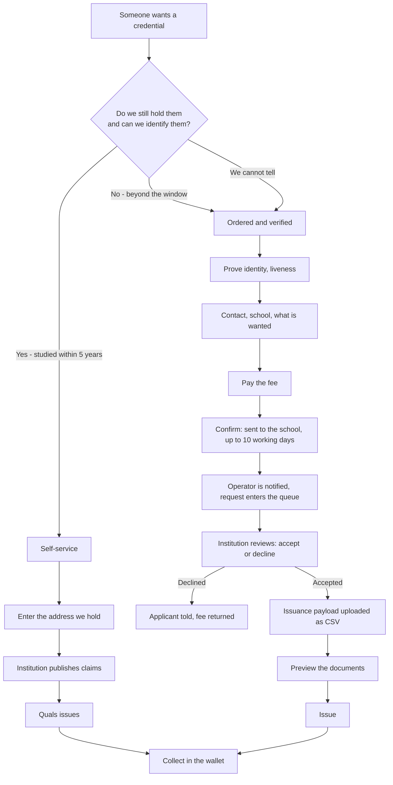

# Two ways to ask: what UCLA's transcript ordering teaches, and what it exposes in ours

**Status:** Discovery complete, awaiting decisions
**Source:** <https://registrar.ucla.edu/student-records/academic-transcript/order-an-academic-transcript>
**Related:** `docs/stories/P0-35`–`P0-40`, `docs/architecture/alumni-manual-request-architecture.md`,
`docs/design/two-request-paths-smart-academy.md`

## Why this document

We want two doors to the same outcome. Someone who studied with us recently signs in with the
address we hold and collects in minutes. Someone we can no longer identify that way has to ask:
prove who they are, tell us what they need and where to send it, pay, and wait while a person
checks the record and the institution agrees.

UCLA already runs exactly this shape, so it is worth reading as a spec rather than inventing one.
The point of this document is (a) to state what UCLA does as fact, (b) to map it onto our system,
and (c) to say plainly what our system does **not** have today, because three of the missing pieces
are load-bearing.

## Objective and success criteria

| Objective | Success looks like |
| --- | --- |
| A recent graduate collects without human help | The whole self-service path completes with no operator action |
| Everyone else can still ask | A person beyond the self-service window can order a credential and be told the outcome |
| Nobody issues on an assertion | A credential exists only after the institution's decision is recorded against the request |
| The wait is honest | The applicant is told the period at the moment they pay, and told again when it changes |
| Every request has an owner | A request is never in a state where no person or queue is responsible for it |

## Facts: how UCLA does it

Taken from the Registrar's page, quoted where the wording carries meaning.

- Most orders go through **MyUCLA**, the institution's own portal. Transcript orders cannot be
  faxed or emailed, because those channels "are not secure transmission methods and cannot
  safeguard personal data".
- **Current students, and noncurrent students who attended within the last six years, must order**
  through MyUCLA, and need a **UCLA Logon ID**.
- **Noncurrent students without a UCLA Logon ID, who last attended more than six years ago, can
  order through Parchment** (the official UCLA transcript agent), and need a **learner account**.
  Such orders "may take a few days longer to process because student status must first be confirmed
  by UCLA".
- Electronic PDF and mailed transcripts are **processed through Parchment** either way.
- After ordering a digital PDF, "the recipient is sent instructions on how to access it through a
  secure site. Once accessed, the recipient has 24 hours to save the transcript file."
- Fees: most transcripts free; no fee for USPS first-class to a US address; "fees for services and
  expedited delivery, and special handling, appear on the order form".
- Attachments (AACOMAS, PharmCAS, SOPHAS, LSAC, AMCAS) are uploaded with the order, and the
  applicant's **CAS ID is required**; two of those routes do not need an attachment at all.
- **Named exceptions**: Dentistry, Law (graduated 1990 or earlier), Medicine, and Extension each
  order through their own school instead.
- Delivery time is **not** included in processing time.

### The pattern underneath the copy

1. **The split is by the institution's ability to identify you, not by who you are.** The line is
   a credential the institution already issued (a Logon ID). "Six years" is a proxy for "we still
   have you on file".
2. **The default is the institution's own portal.** The agent is the exception path.
3. **The exception path is openly slower, and says why**: status must be confirmed. The expectation
   is set before the applicant starts, not discovered afterwards.
4. **Money and delivery do not change with the route** — only the route does. Fees are on the order
   form in both cases.
5. **Exceptions are named on the page** rather than discovered in a failure.
6. **The agent is named and vouched for** ("the official UCLA transcript agent"), so a third party
   is not a surprise.

## The same shape in our system

| UCLA | Us | State |
| --- | --- | --- |
| MyUCLA, Logon ID required | Smart Academy `/get-credentials`, sign in with the address we hold | Built |
| Parchment, learner account | Quals `/issue` plus a request queue in the Quals portal | Partly built |
| UCLA Registrar decides and confirms status | Smart Academy / the institution's registry | **Not built** |
| Six years | Five years | **Rule chosen, data does not exist yet** |
| "Status must first be confirmed" | Review step: pending → accepted / declined | **Not built** |
| 24 hours to save the PDF | 30-day invitation window | Built |
| Fees on the order form | Request fee, charged before the review | **Not built** |
| Named school exceptions | Only Smart Academy is offered for now | Declared |

### One difference that matters

For UCLA, Parchment is a **channel**; the institution remains the issuer of record. In our design
Quals is both the channel **and** the service that signs the credential. That is why the review step
is not a nicety: if Quals issues without the institution's decision recorded, Quals asserts an
academic fact it was never told. The decision must be captured against the request, and the claims
must come from the institution, before anything is signed.

## The two flows, and the door between them

Both doors end in the same place — a link the holder opens, signs in for, and collects from. That is
deliberate: the wallet, the offer and the code path are already built and should not fork.

## What exists today, and what does not

This is the part that decides the size of the work.

| Capability | Where it would live | Today |
| --- | --- | --- |
| Identity document and liveness | Didit, called server-side | In the **academy** app only (`didit-service.js`: `createKycSession`, `getKycSessionDetails`, `parseKycResults`, `handleKycWebhook`). Quals has **no identity verification of any kind** |
| Payments | Stripe | Real in the academy (`/api/create-checkout-session`, `/api/offer/checkout`, `/api/session-status`, encrypted keys in `payment_config`, plus bank transfer and financial aid). Quals has a **stub**: `issuer.createCheckout()` returns `https://issuer.smartcollege.example/checkout/<id>` |
| The institution supplies the claims | `POST /issuance/invitations` (API key; institution taken from the key) | The route is built and tested and **nothing calls it**. The academy's live flow calls `POST /academy/requests`, which **generates** a record from `credential-generator.js` — including a graduation year picked at random from a fixed range |
| "Studied within five years" | The institution's registry | **Does not exist.** The academy's Postgres has `users` (`journey_stage`, `enrolled_at`), `academic_terms`, `program_terms`, `enrollment_courses`, admissions — but no graduation date, no completion record, and no alumni concept at all: the journey stops at `enrolled` |
| A review queue with accept / decline | Quals portal | Nothing in Quals. The pattern exists in the **academy** (`admissions_decisions` with `decision IN ('offer_approved','declined')`, `reason`, `reviewer_note`, `reviewed_by`, and `/admin/applications/:userId/decision`), not where the issuing happens |
| Uploading a file | Issuer service | Nothing anywhere. `POST /credentials/issue` is one credential at a time and the invitations API takes one holder per call. There is no CSV, batch or bulk path in the repository |
| Previewing what will be issued | Issuer service | `buildShareDocument()` and `renderSharePdf()` render a document from claims, but they are keyed to a *share*. A request preview needs the same layout fed from claims directly |
| Telling an operator there is work | Email | Brevo sending exists (`sendEmail`, `sendOtpEmail`, `sendCredentialsReadyEmail`). There is no notion of a queue owner or an SLA reminder |
| A request that can be in a state | `db.js` (9 tables) | Nothing. No table holds an application, a decision, a payment or a document |

### The three load-bearing gaps

1. **No real claims reach the issuer.** The publish API exists and is unused; the live path invents
   records. Until the registry supplies claims, "self-service" issues a synthetic degree.
2. **No way to decide who is within the window.** The institution has no graduation or
   attendance-end date, so the five-year question cannot be answered from data today.
3. **Nowhere to put a request.** No table, no queue, no state, no owner.

## Decisions that must be taken first

### Who may assert an academic fact?

| Option | Shape | Consequence |
| --- | --- | --- |
| A. Quals verifies and issues on acceptance | Quals holds identity evidence, institution only says yes/no | Simplest queue, but Quals ends up holding claims it generated from a form |
| **B. Quals verifies; the institution supplies the claims at the accept step** | Identity and payment at Quals; the CSV upload is the institution asserting the record | **Recommended.** One issuer of record, claims provenance stays with the institution, and the CSV step already has a natural home |
| C. The academy verifies identity and publishes | Academy runs Didit, Quals only issues | Nothing new in Quals, but the applicant must be an academy user to order, which is exactly the population that is not |

Option B also explains the CSV step in the user's flow: it is not a convenience, it is the moment
the institution states the record.

### What does "within five years" mean, and what happens when we cannot tell?

Three answers are possible, and the page must handle all three:

- **Yes** → self-service.
- **No** → order.
- **We cannot tell** (no record, name changed, no email on file, ambiguous match) → order. Never a
  dead end, and never an accusation.

## Unknowns, and how to close each

| Unknown | Why it matters | How to resolve |
| --- | --- | --- |
| Which date anchors the five years — graduation, last term end, or last enrolment? | Decides the rule and the query | Product decision, then a registry field; see below |
| Where does the completion record come from? | The rule cannot be evaluated without it | Add completion/graduation to the registry (academy story), or read it from term data as an interim |
| Fee, currency, who receives it | Payment integration and reconciliation | Product decision; if Quals takes it, a settlement arrangement with the institution is needed |
| What happens to the fee on decline | Refund liability, consumer law, wording on the page | Must be decided before the payment story is built |
| 10 working days — from payment or from acceptance? | It is a promise made to the applicant | Product decision, then stated on the page and in the confirmation email |
| Retention of ID evidence and documents | We would be holding identity documents, which we do not today | Policy decision plus a deletion job; see the architecture doc |
| Does the applicant need a Quals account before paying? | Decides whether we verify an address before taking money | Recommend: yes, verified by the existing email code step, so the collection link later lands somewhere trustworthy |
| One request, several credentials? | The payload decides, so it should be possible | Default to allowing it; the CSV carries it |

## Risks

| Risk | Severity | Likelihood | Note |
| --- | --- | --- | --- |
| Issuing on a self-reported claim | Critical | Medium | Only the institution's accepted decision plus institution-supplied claims may reach the issuer |
| Holding identity documents and liveness evidence with no retention rule | Critical | High | New obligation for Quals, which holds no documents today |
| Payment taken before an outcome that may be no | High | High | Refunds and chargebacks; the page must state the rule before payment |
| The demo generator and the real registry sharing one code path | High | Medium | A wrong branch issues a randomly generated degree. Fence the generator behind an explicit flag and refuse it in production |
| A queue nobody owns | High | Medium | UCLA names the office; we would have one mailbox. Needs an owner, a notification and an ageing reminder |
| Telling "we cannot identify you" apart from "you are not who you say" | Medium | High | Copy must not accuse; the applicant is told the next step, not a verdict |
| CSV import becomes a new trust boundary | Medium | Medium | Claims from a file need validation and a preview before anything is signed |
| Two systems, one applicant | Medium | Medium | The academy and Quals must not both claim to be the institution on the same screen |

## Data and analytics

Events, with the two service clocks that decide whether the promise holds:

- `request.started`, `eligibility.decided{match, no_match, unknown}`
- `identity.started`, `identity.completed`, `identity.failed{reason}`
- `request.details_captured`, `payment.started`, `payment.completed`, `payment.failed`
- `request.submitted`, `operator.notified`
- `request.accepted`, `request.declined{reason}`
- `payload.uploaded`, `payload.rejected{row, reason}`, `request.issued`, `credential.collected`
- `request.expired`, `fee.refunded`

KPIs: share of applicants served self-service; median time from payment to decision; median time
from decision to issued; proportion of requests declined; refund rate; payload rejection rate.

## Recommended next actions

1. Decide the three questions above: the anchor date for the window, who may assert a fact (B is
   recommended), and the fee/refund rule. Nothing else is safe to build first.
2. Add completion data to the institution's registry, and expose one endpoint the decision point can
   call: given an email (and optionally a name and date of birth), answer *yes / no / unknown*.
   Until this exists, flow A cannot be real.
3. Build the request record and the queue in Quals (states, owner, ageing), because the human
   process is the part the applicant experiences as the promise.
4. Wire claims through the publish API in flow A, so both doors end with institution-supplied
   claims and the generator becomes a demo-only fixture.
5. Present the two doors on Smart Academy with the real costs, the real wait, and the honest
   "if you are not sure" branch — see `docs/design/two-request-paths-smart-academy.md`.

## What I am assuming

- Quals is the agent and the issuer, and Smart Academy is the institution of record for now.
- The five-year window is measured on the institution's own data, not the holder's assertion.
- Only Smart Academy is offered as a school for now, so the school field is a single option that
  still exists in the record.
- The wallet, the offer and the QR path stay as they are; both doors end there.
