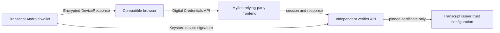

# Independent ISO mdoc Presentment Discovery

## Objective and success criteria

Deliver an independent Android holder, reusable verifier API, and MyJob relying-party website flow using `org-iso-mdoc`. Success is a device-authenticated, consent-based exchange yielding only MyJob-requested academic claims after cryptographic validation. The verifier API remains suitable for use by additional relying parties. Smart College and Multipaz are reference sources only, not runtime dependencies.

## Facts

- `verifier-service` currently verifies standalone `IssuerSigned` CBOR only; it has no Digital Credentials API session, HPKE, `DeviceRequest`, or `DeviceResponse` support.
- `verifier-frontend` can become the MyJob Vite/React relying-party website; it has an existing API proxy and result pages, but only supports legacy QR-payload verification.
- `mobile-wallet` has an Android Keystore P-256 key, encrypted credential storage, biometric/device-credential gating, and a local parser for the four display claims. It does not register a Digital Credentials provider or produce a DeviceResponse.
- The active issuer binds an Android Keystore public key to issued credentials, which provides the key material needed for device authentication.
- The current hand-written `mdoc-core.js` verifies an issuer signature and item digests but does not parse or validate complete ISO `DeviceResponse` structures.
- Published verifier libraries exist, but must be evaluated against the project's `IssuerSigned` form, issuer trust configuration, reader authentication, and DC API HPKE requirements before adoption.

## Assumptions

- The relying-party frontend is served over a secure origin in production; localhost is used only for development.
- A compatible browser and Android Digital Credentials provider are available for physical-device validation.
- The verifier organization can provision a distinct reader signing certificate and configure approved issuer trust anchors.

## Unknowns and resolution actions

| Unknown | Resolution | Exit evidence |
|---|---|---|
| Exact holder-provider registration data required by the selected Android credential-provider API | Prototype with the published AndroidX registry provider APIs on a test device | Provider appears as an eligible `org-iso-mdoc` handler |
| Interoperable reader-auth certificate profile | Validate against the selected browser/provider and document trust-anchor installation | Reader-authenticated request is accepted |
| Server library compatibility with the issued credential encoding | Validate a generated target credential against a deterministic DeviceResponse fixture | Issuer and device authentication both pass |
| Response transport shape from the browser | Capture and contract-test the `DigitalCredential` response from a compatible browser | Fixture decodes and HPKE decrypts |

## Dependency map

## Data and analytics

Record only non-sensitive operational events: `presentation.request_created`, `presentation.request_expired`, `presentation.response_received`, `presentation.validation_succeeded`, and `presentation.validation_failed` with a reason code and duration. Do not log mdoc bytes, encrypted responses, identifiers, or claim values. Primary quality metrics: session-replay rejection rate, verification success rate, and $p95$ validation duration.

## Risk register

| Severity | Risk | Impact | Likelihood | Mitigation |
|---|---|---|---|---|
| Critical | Treating raw stored mdoc as a presentation | Bypasses device proof and request binding | Medium | Accept encrypted ISO DeviceResponse only |
| Critical | Missing/incorrect transcript or HPKE binding | Replay or disclosure to wrong RP | Medium | One-time sessions and fixture-based protocol tests |
| High | No explicit issuer trust anchor | Attacker-controlled issuer accepted | Medium | Pinned verifier configuration; reject unknown chains |
| High | Unauthenticated reader | User cannot assess requester authenticity | Medium | Reader-auth certificate and wallet trust UI |
| Medium | Browser/provider rollout variance | Feature unavailable to users | High | Capability detection and clear unsupported state |

## Recommendation

Proceed in the story's four delivery increments. The first code change must be a narrowly scoped request/session contract and RP capability flow; do not claim device interoperability until the wallet provider and full cryptographic validation are implemented and tested.
