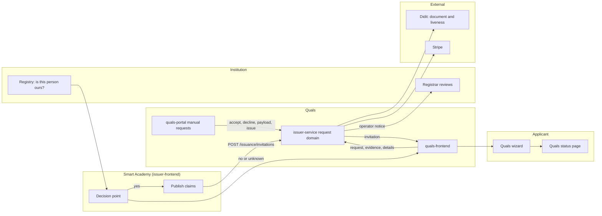
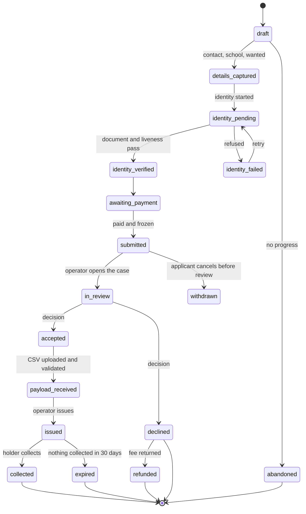
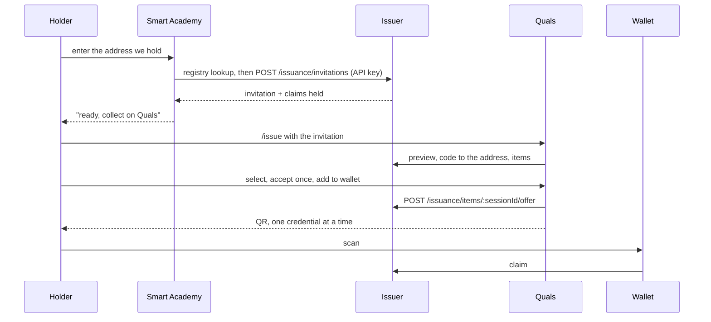
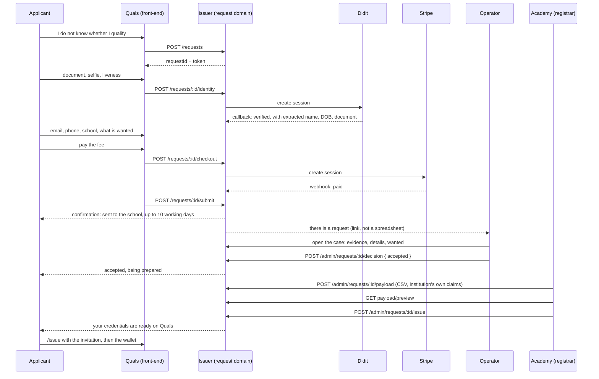

# Architecture: ordering a credential when we cannot identify the holder

**Status:** Proposed
**Components:** `issuer-service` (new request domain), `quals-frontend` (applicant wizard and status
page), `quals-portal` (manual requests queue), `issuer-frontend` (Smart Academy decision point),
Smart College registry (eligibility answer — separate repository)
**Related:** `docs/analysis-discovery/alumni-order-model-discovery.md`,
`docs/design/two-request-paths-smart-academy.md`, `docs/stories/P0-35`–`P0-40`

## Requirements

**Functional**

1. Decide, from the institution's own data, whether a person can serve themselves: *yes / no /
   unknown*. All three answers are handled; only *yes* skips the queue.
2. Take an order from someone we cannot identify: identity document and liveness, contact details,
   the school, and what they want issued.
3. Take payment before the review, and say so on the page before the payment.
4. Tell the applicant what happens next, in writing, including the period.
5. Give an operator a queue: the request, the identity evidence, the details, and a decision of
   accept or decline with a reason.
6. On acceptance and issue, let the institution state the record as a CSV, show a preview of the
   documents it would produce, and issue only after the preview is accepted.
7. Deliver the outcome through the existing collection path, unchanged.

**Non-functional**

| Concern | Position |
| --- | --- |
| Personal data | Identity evidence and documents are the most sensitive thing this network would hold. Stored encrypted at rest, access by permission, retention and deletion defined before launch |
| Authorisation | The queue is scoped to the institution the administrator belongs to, as every other portal section is |
| Idempotency | Payment confirmation, identity callback and issue are all repeatable without creating a second request, charge or credential |
| Audit | Every state change names an actor and a time, on the same footing as the existing audit log |
| Availability | Nothing in the ordered path blocks the self-service path; the queue may be down without stopping collection |
| Accessibility and mobile | The wizard is phone-first; it is the path an older graduate is most likely to take on a phone |

## Options considered

### Where the request lives

| Option | Pros | Cons |
| --- | --- | --- |
| **A. In the issuer service, beside invitations** | One database, one issuer of record, the request can become an invitation on issue with no copying, reuse of existing admin auth and API-key plumbing | The issuer service grows a second responsibility (case management) |
| B. In the Quals portal, as an application-shaped store | Closest to the review UI | Two writers to one credential story; portal would need its own store, and issuance would then be driven from a UI instead of a service contract |
| C. In the academy's Postgres | Reuses `users`, admissions and document tables | The academy is the institution; the agent holding the applicant's case would be the institution reviewing itself, and the identity evidence would leave the network |

**Recommended: A.** The decisive argument is not storage convenience but ownership of the decision:
the request must live where issuing happens, so there is one place that can refuse to issue.

### Who takes the money

| Option | Pros | Cons |
| --- | --- | --- |
| **A. Quals takes the fee, settles with the institution** | One integration, one receipt, one refund path; the applicant pays the agent they are dealing with, as with UCLA and Parchment | Needs a settlement arrangement and a stated fee split |
| B. The institution's Stripe account (the academy's existing integration) | Money lands with the beneficiary immediately | The applicant leaves Quals mid-flow; refunds become manual; two payment systems across two sites |
| C. Bank transfer only, reconciled by hand | No card data, no chargebacks | The applicant waits for confirmation, and the 10-day promise starts before we know they paid |

**Recommended: A**, with B available as a per-institution setting later, using the academy's existing
payment configuration as the model. C is rejected because the promise must start from a state we can
observe.

### How claims reach the issuer

| Option | Pros | Cons |
| --- | --- | --- |
| **A. The institution publishes claims with its API key, at the accept step** | Provenance is unambiguous; already built and tested; refuses another institution's name | Needs a CSV-to-claims mapping per institution |
| B. The applicant's form supplies the claims | No integration | The issuer would sign a self-reported academic fact — unacceptable |
| C. Quals generates the record from the demo generator | Nothing to build | This is the existing demo behaviour and is the defect this work exists to remove |

**Recommended: A.** The CSV upload in the requested flow *is* option A, given a human interface.

## Recommended architecture



The ordered path adds one domain to the issuer service and one section to the portal. Everything
after *issue* is the path that already exists: the request produces an **invitation**, so the holder
collects through the same page, the same code step and the same offer.

That equivalence is the main structural decision: **a request is a case; an invitation is a
deliverable.** The case owns the decision and the evidence; the invitation owns the holder's
collection and its expiry.

## Data model

SQLite in `db.js`, following the existing conventions (snake_case, opaque TEXT ids, ISO timestamps,
`CREATE TABLE IF NOT EXISTS` plus `PRAGMA table_info` before `ALTER TABLE`).

```sql
requests
  request_id        TEXT PRIMARY KEY
  institution       TEXT NOT NULL          -- from the school selected, validated against client_orgs
  applicant_email   TEXT NOT NULL
  applicant_phone   TEXT
  applicant_name    TEXT                   -- as claimed, never as asserted fact
  school            TEXT NOT NULL          -- Smart Academy for now
  wanted            TEXT NOT NULL          -- json array: qualification | transcript
  delivery_email    TEXT NOT NULL          -- where the collection link goes
  status            TEXT NOT NULL          -- see the state machine
  identity_ref      TEXT                   -- Didit session id
  identity_status   TEXT                   -- pending | verified | failed | manual_review
  identity_summary  TEXT                   -- json: what was checked, never the raw document
  fee_amount        INTEGER
  fee_currency      TEXT
  payment_ref       TEXT                   -- Stripe session id
  payment_status    TEXT                   -- none | pending | paid | refunded | failed
  terms_version     TEXT
  submitted_at      TEXT
  reviewed_by       TEXT
  reviewed_at       TEXT
  decision_reason   TEXT
  reviewer_note     TEXT
  issued_at         TEXT
  invitation_id     TEXT                   -- the deliverable, on issue
  expires_at        TEXT
  created_at        TEXT NOT NULL
  updated_at        TEXT NOT NULL

request_evidence            -- what the institution was shown, and nothing more
  evidence_id       TEXT PRIMARY KEY
  request_id        TEXT NOT NULL REFERENCES requests(request_id) ON DELETE CASCADE
  kind              TEXT NOT NULL        -- document_front | document_back | selfie | liveness
  mime_type         TEXT
  bytes             BLOB                 -- stored, retention-bound, access-logged
  sha256            TEXT
  captured_at       TEXT

request_payloads            -- the institution's assertion, kept as sent
  payload_id        TEXT PRIMARY KEY
  request_id        TEXT NOT NULL REFERENCES requests(request_id) ON DELETE CASCADE
  filename          TEXT
  row_count         INTEGER
  accepted          INTEGER              -- 1 only after a clean validation
  validation_json   TEXT
  claims_json       TEXT                 -- the claims exactly as the institution sent them
  uploaded_by       TEXT
  uploaded_at       TEXT

request_events              -- the audit trail, and the ageing clock
  event_id          TEXT PRIMARY KEY
  request_id        TEXT NOT NULL REFERENCES requests(request_id) ON DELETE CASCADE
  event             TEXT NOT NULL
  actor             TEXT
  detail_json       TEXT
  created_at        TEXT NOT NULL
```

Indexes: `requests(status, institution)`, `requests(applicant_email)`,
`requests(invitation_id)`, `request_events(request_id, created_at DESC)`,
`request_evidence(request_id)`.

**Retention.** Evidence is the liability. Default: deleted 90 days after the decision, or
immediately when a request is declined and refunded, whichever comes first. The decision, the
payload and the events are kept, because they are the record that the credential was issued on the
institution's word.

## Interface contracts

Applicant-facing, from the Quals front-end:

| Route | Auth | Purpose |
| --- | --- | --- |
| `POST /requests` | none (rate-limited) | Open a case: school, wanted, contact details. Returns `requestId` and its own opaque token |
| `POST /requests/:id/identity` | request token | Start the identity check, returns the Didit URL to send the applicant to |
| `GET /requests/:id/identity` | request token | Poll the outcome; never returns evidence bytes |
| `POST /requests/:id/checkout` | request token | Create the payment session for the request's fee |
| `POST /requests/:id/submit` | request token | Freeze the case, send the applicant confirmation and notify the operator. Refuses unless identity is verified and payment is paid |
| `GET /requests/:id/status` | request token or emailed code | What the applicant sees: received, in review, accepted, declined, issued |

Operator-facing, through the portal's existing proxy (which needs no route list, being a
pass-through):

| Route | Auth | Purpose |
| --- | --- | --- |
| `GET /admin/requests` | admin bearer, org-scoped | The queue: status, age, school, applicant, fee |
| `GET /admin/requests/:id` | admin bearer, org-scoped | The case: identity result, details, wanted, fee, events |
| `GET /admin/requests/:id/evidence/:evidenceId` | admin bearer, org-scoped, audited | One evidence file, access written to `request_events` |
| `POST /admin/requests/:id/decision` | admin bearer, org-scoped | `{ decision: 'accepted' \| 'declined', reason, note }`; emails the applicant |
| `POST /admin/requests/:id/payload` | admin bearer, org-scoped | CSV as text; validates and stores; returns a per-row report |
| `GET /admin/requests/:id/payload/preview` | admin bearer, org-scoped | The documents that would be issued, rendered from the claims |
| `POST /admin/requests/:id/issue` | admin bearer, org-scoped | Issuance. Creates the invitation, emails the holder, refuses without an accepted decision and a validated payload |

Didit posts its decision to `POST /requests/:id/identity/callback`. The webhook is verified by
shared secret and by looking the session up against the request, never by trusting the payload.

## The CSV contract

One row per credential, one request per holder. Columns map to the namespaces the issuer already
understands, so nothing new has to be invented:

| Column | Maps to |
| --- | --- |
| `email` | holder address; must equal the request's delivery address, or the file is refused |
| `full_name` | the holder's name in the claims |
| `student_id` | the institution's identifier for them |
| `programme_title`, `degree_level`, `field_of_study`, `graduation_date` | `org.iso.23220.education.qualification.1` |
| `institution_name` | the institution named in the qualification |
| `total_credits`, `courses` | `org.iso.23220.education.transcript.1`; `courses` as a JSON array string |
| `credential` | `qualification` \| `transcript` \| `both`, deciding which namespaces the row carries |

Rules, all enforced before anything is issued:

- The whole file is refused if any row fails. There is no partial issue, because a half-issued
  request is worse than a rejected file.
- Dates must parse; the existing claims validation in the issuer service is reused rather than
  rewritten.
- The address must match the request, so an accepted case cannot be redirected to a third party.
- The number of credentials must match what was accepted, or the difference is reported explicitly
  and acknowledged by the operator.

Preview renders the documents with the existing `buildShareDocument()` layout fed from the
payload's claims, and `renderSharePdf()` for the PDF, so what the operator sees is the same
document the holder will be able to share. Issue is refused until the preview has been opened for
the current payload version, so the operator cannot press the button without having looked.

## States



Every state has an owner. `submitted`, `in_review` and `payload_received` are the queue's problem;
`issued` is the holder's. Ageing reminders fire at 2 and 5 working days in review, and at 5 working
days with a payload waiting.

## Sequences

### Flow A — the institution can identify the holder



### Flow B — we cannot, so the holder orders



## Failure modes and how each is handled

| Failure | Handling |
| --- | --- |
| Identity refused | Applicant may retry; three failures move the case to `manual_review` and an operator decides whether to continue, refund, or ask for a different document |
| Payment succeeded, webhook lost | The checkout success page reconciles by asking Stripe, the way the academy's offer checkout already does |
| Issued twice | Issue is idempotent per request: it returns the existing invitation rather than creating a second |
| Payload valid but wrong (right person, wrong programme) | Nothing is signed until issue, and revocation already exists; the queue keeps the payload that was used |
| Operator never looks | Ageing reminders to the queue owner, then escalation; the applicant's status page shows "in review" honestly rather than implying progress |
| Institution declines | Applicant told with the reason the institution allows to be shared, and the fee returned by the same rule the page stated |
| Didit unavailable | The ordered path cannot start; the self-service path is unaffected |

## Rollout and rollback

1. **Land the request domain and the queue with the fee switched off** (fee 0), against the test
   sites only. No real applicants, no money.
2. **Add the decision point on Smart Academy** in a form that still routes everyone to
   self-service, and observe the *yes / no / unknown* split on real traffic. This is the cheapest
   possible way to learn how big the ordered population actually is.
3. **Turn the ordered path on for one institution** (Smart Academy) with a real fee and the real
   10-working-day promise, with the registry lookup in place.
4. **Open the decision point**, so *no* and *unknown* go to the wizard.

Rollback: the ordered path is additive. Disabling it means the decision point sends everyone to
`/get-credentials` and the queue stops accepting submissions, which is a configuration change, not
a deploy of the issuer. Collection, offers and revocation are untouched throughout.

## Operational concerns

- **Observability**: every state change writes `request_events`; the queue reports counts by status,
  age buckets, and time-to-decision. Alert on requests in `in_review` beyond the promise and on any
  request in `submitted` with no operator notice sent.
- **Capacity**: trivial by volume, but the queue is human. Capacity planning means named reviewers
  per institution, not CPU.
- **The demo fence**: the generator in `credential-generator.js` must be unreachable unless an
  explicit demo flag is set, and must refuse to run against a production institution. This is the
  single most dangerous piece of existing code in the new path.
- **Secrets**: a Didit key and a Stripe key become part of the issuer service's configuration,
  alongside the existing API keys and signing material.

## Decisions (mini ADRs)

**ADR-1: The request lives in the issuer service.** Rejected: the portal, because issuance would
then be driven from a UI rather than a service contract; and the academy, because the agent would
be reviewing itself.

**ADR-2: A request produces an invitation on issue.** Rejected: a second collection path for
ordered credentials, because it would double the wallet-facing surface and the expiry rules.

**ADR-3: Claims come from the institution, at the accept step, as a validated file.** Rejected:
self-reported claims, and the demo generator.

**ADR-4: Payment before the review, with the refund rule stated before payment.** Rejected: payment
after acceptance, because it lengthens the promise and adds a second abandonment point; and payment
by transfer, because the promise could not start from an observable state.

**ADR-5: The decision point answers yes / no / unknown, and unknown goes to the queue.** Rejected: a
hard yes/no, because a wrong *no* turns away a legitimate graduate and a wrong *yes* issues a
credential on no evidence.

**ADR-6: Identity evidence carries its own retention clock.** Rejected: keeping evidence with the
case indefinitely, because there is no reason to hold a copy of somebody's passport after the
decision that needed it.
