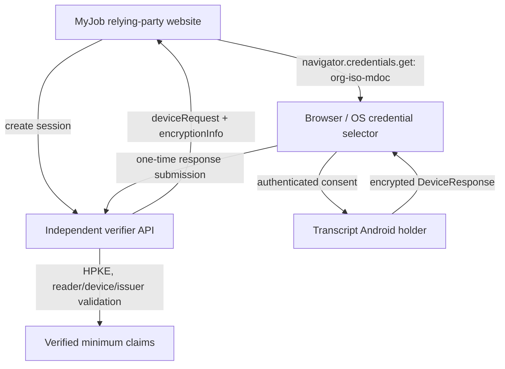

# Independent ISO mdoc Presentment Architecture

## Requirements

The solution must use the W3C Digital Credentials API `org-iso-mdoc` protocol, retain no presentation payload or claim values beyond the active request, authenticate both reader and device, protect the DeviceResponse with DC API HPKE, verify against independently configured issuer trust anchors, and preserve the wallet's existing biometric/PIN gate.

## Options considered

| Option | Benefits | Risks | Decision |
|---|---|---|---|
| Copy or link either reference workspace at runtime | Fast initial integration | Violates independent runtime boundary; tight coupling | Rejected |
| Accept a raw mdoc upload | Smallest server change | No device authentication, transcript binding, consent, or HPKE | Rejected |
| Independent API, RP, and Android provider using maintained protocol dependencies | Clear boundary, testable components, standards-aligned | More implementation and compatibility work | Selected |

## Selected design

### Service boundary

- **MyJob relying-party website:** obtains a one-time request, feature-detects the Digital Credentials API, starts the request from a user action, then submits the browser-returned `DigitalCredential` unchanged. It renders only API-verified results.
- **Verifier API:** owns nonce generation, ephemeral HPKE private keys, the exact `dcapi` session transcript, reader authentication material, session expiry/replay control, and cryptographic validation. Browser and wallet never receive private verifier keys.
- **Android holder:** owns the encrypted credential, non-exportable device key, user authentication, consent, request validation, disclosure selection, and DeviceResponse encryption. It must not accept an unverifiable reader request.

## API contract direction

`POST /presentation/sessions` creates a maximum five-minute session and returns a Digital Credentials request. `POST /presentation/sessions/{id}/response` accepts the DigitalCredential envelope and consumes the session before decryption. The final response is a minimal verified-claims model or a stable, non-sensitive error code. Relying-party identity and origin are supplied per session so that MyJob and future relying parties use the same independent API without sharing session state.

## Failure behavior and rollback

Fail closed for unavailable reader trust, unknown issuer, malformed CBOR, cryptographic errors, unsupported client, and replayed/expired sessions. Rollback is disabling the presentation routes or frontend entry point; this leaves issuer and wallet browse/issuance paths unchanged.

## Operational concerns

Use short-lived in-memory session state only for the initial delivery, then move sessions to a TTL-backed shared store before multi-instance deployment. Emit non-sensitive outcome/reason/duration metrics. Rate-limit session creation and response submission before public exposure.
