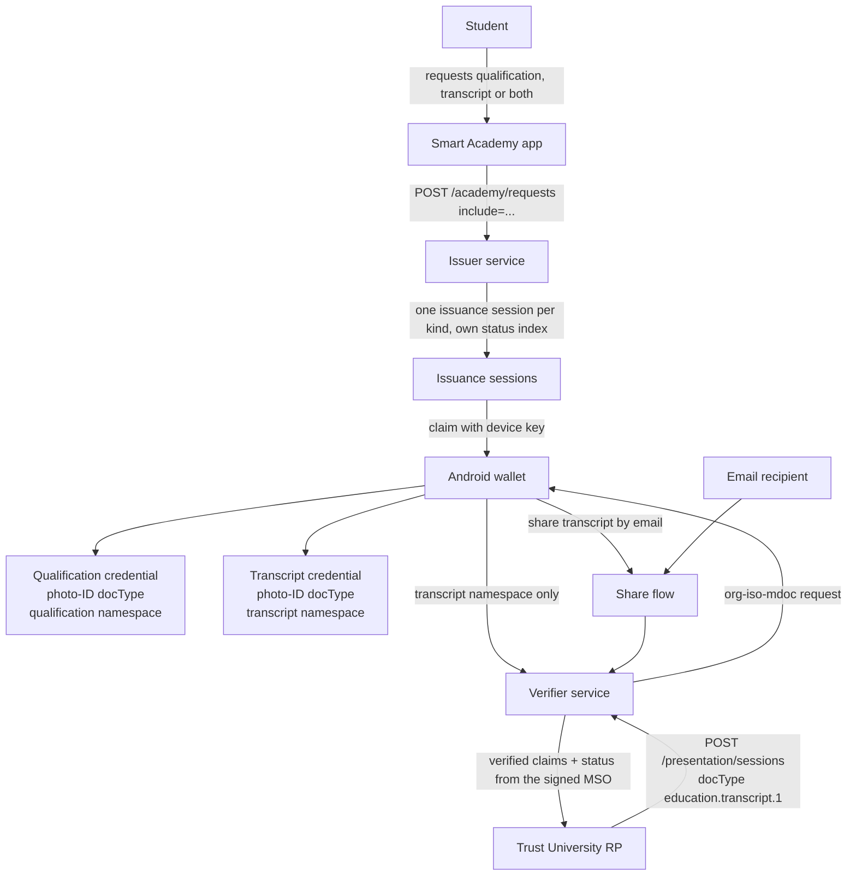

# Transcript Credential Architecture

## Requirements

A holder must be able to obtain a qualification credential, a transcript credential, or
both; a registrar must be able to request transcript information specifically; a Smart
Academy administrator must be able to see and manage what it issued; and a holder must
be able to share a transcript by email through the existing share and verification
path. Existing credentials in wallets and the My Jobs relying party must keep working
unchanged, and revocation must stay per credential.

## Options considered

| Option | Benefits | Risks | Decision |
|---|---|---|---|
| Keep one credential with all namespaces; choose only at presentation | No issuer change | Wallet cannot tell a qualification from a transcript; a registrar must request the identity credential and receive qualification claims with it; one status applies to everything | Rejected |
| One docType for both kinds - `org.iso.23220.photoid.1`, carrying the personal components - with the academic claims in their own namespace: `org.iso.23220.education.qualification.1` or `org.iso.23220.education.transcript.1` | The transcript keeps the personal components a registrar needs; the academic claims are separated per kind; existing credentials and the My Jobs request are untouched; a relying party selects by namespace, which is what the protocol is for | docType no longer identifies the kind, so the wallet, the portal and the credential offer must label by namespace | **Selected** |
| A distinct docType per kind (`org.iso.23220.education.transcript.1` for the transcript) | The kind is visible in the docType | Splits the document type away from the personal components it shares with a qualification; an unfamiliar docType to wallets and relying parties | Rejected |

## Selected design

### Credential kinds

Both kinds are issued as a photo-ID document (`org.iso.23220.photoid.1`) carrying the
holder's personal components; the academic namespace decides the kind.

| Kind | docType | Namespaces held | Used by |
|---|---|---|---|
| Qualification | `org.iso.23220.photoid.1` | `org.iso.23220.photoid.1` (personal), `org.iso.23220.education.qualification.1` | My Jobs, existing credentials |
| Transcript | `org.iso.23220.photoid.1` | `org.iso.23220.photoid.1` (personal), `org.iso.23220.education.transcript.1` (grades) | Trust University, sharing |

Selection is by namespace, not by docType: a registrar asking for the photo-ID docType with
the transcript namespace can only be satisfied by the transcript credential. Because the
docType is shared, the kind is reported explicitly (`kind`, `label`,
`academicNamespaces`) so the wallet, the portal and the academy app label a credential from
what it holds rather than guessing. A credential holding both academic namespaces - the
combined credential issued before the choice existed - is reported as `academic`.

Identity travels with both kinds so a registrar can bind a transcript to a person. The
holder still discloses namespace by namespace, so sharing a transcript can withhold
identity fields exactly as sharing a qualification does today.

### Service boundary

- **Issuer service** owns the kind definitions, per-kind namespace assembly, the
  issuance choice, the status index and the registry row. It never issues a namespace
  that does not belong to the requested kind.
- **Smart Academy app** presents the choice and claims each resulting credential.
- **Management portal** shows the kind per credential and scopes everything to the
  organisation, as it already does for one kind.
- **Verifier service** is unchanged in behaviour: it is told the docType and namespaces
  by the relying party, resolves status from the credential's signed MSO, and returns
  the disclosed claims.
- **Wallet** stores and labels each credential by kind and shares one kind at a time.

## Claim sets: what is compatible with what

The EU (ELMO/EuroLMAI) and US (PESC/CEDS) transcript models are not rival formats to choose
between. They describe largely the same study, and their differences fall into three groups, only
the third of which needs structural separation.

| Kind of difference | Examples | How to carry it |
|---|---|---|
| **Same concept, different vocabulary or scale** | credits (ECTS vs US credit hours), marks (10-point scale vs 4.00 GPA vs letter), level (EQF vs class standing), programme classification (ISCED-F vs CIP), institution identifier (SCHAC/Erasmus vs a national institution code), academic period (free-text term vs coded session) | One element, **scheme-qualified**: a value never travels without the scheme it belongs to (`gradingSchemeLocalId`/`identifier type=…` in ELMO, one element per coding system in PESC). This is how both standards solve it internally |
| **Concept that exists on only one side** | *US:* attempted vs earned credits, grade point average with quality points, several summaries, credit basis and override school, official/partial document status, release authorisation, destination and tracking. *EU:* ECTS grade, EQF level, language of instruction, diploma supplement | Additive elements. Nothing conflicts; a reader ignores what it does not understand |
| **Genuinely conflicting or jurisdiction-legal** | credit arithmetic (ECTS and credit hours must never be summed or silently converted), consent framing (a FERPA release is not a GDPR purpose limitation), identifiers we should not model at all (national insurance/SSN, ethnicity, residency) | A separate namespace, or not modelled |

### Namespace strategy

1. **The transcript namespace carries the shared core**, model-neutral and scheme-qualified:
   institution with a typed identifier, programme with a coded classification (scheme named),
   results with the scale beside every mark, credits with their scheme, the academic period, the
   outcome, and the aggregates.
2. **One additional namespace carries the administrative-record extras** that a US-style reader
   asks for: attempted versus earned credits, averages with their range and quality points,
   summary types, credit basis and override school, the record's own document identity,
   official or partial status, release authorisation, destination and tracking reference.
3. **A third namespace, only if it is ever needed, carries EU recognition extras**: ECTS grade,
   EQF level, language of instruction, diploma supplement reference.
4. **A total is always per scheme.** This one rule is what prevents the dangerous failure mode:
   a US registrar reading ECTS as credit hours, or someone quietly converting 27 ECTS into credit
   hours and averaging them together.

A namespace groups claims that are requested together; it does not make a credential compatible.
Compatibility comes from values that state their scheme. The reasons to separate at all are to let
a relying party ask for one audience's view without the other's, and to keep jurisdiction-legal
elements off the surface every presentation exposes.

Naming should follow content rather than audience: the administrative-record namespace will be
named for what it holds, not for the country whose practice it came from, because practice changes
and content does not.

### Who asks for which: the division of labour

The two academic namespaces answer different questions, and that - not the country a practice
comes from - is what divides them.

| Namespace | The question it answers | Who asks for it |
|---|---|---|
| `org.iso.23220.education.transcript.1` | *What did this person study, at which institution and programme, over which period, and with what marks, on what scale?* | A recognition officer (ELMO/EuroLMAI), an admissions team, an employer checking a claim |
| `org.iso.23220.education.academic-record.1` | *Is this record authentic, official and complete, who authorised its release, and what does it say in the units the reader works in - credits, averages, quality points?* | A registrar running a credit-hour process, **alongside** the transcript |
| `org.iso.23220.photoid.1` | *Who is the holder?* | Both, for identity binding and selective personal components |

Two shapes are possible, and the element list only makes sense in one of them:

- **A. Two self-contained views.** `academic-record.1` would repeat the programme, the course list
  and the marks in its own terms, so a registrar could request it alone. Each request would stand
  alone, but the largest element (`courses`, all or nothing) would be duplicated, and two elements
  would claim to be the source of truth for the same mark.
- **B. One study view plus a supplement - chosen.** `transcript.1` stays the single source for what
  was studied; `academic-record.1` adds only what a credit-hour process needs on top of it: the
  same study in its units, the figures that process computes, and the standing and release of the
  record. A registrar requests it together with `transcript.1` and `photoid.1`.

The consequences of B:

1. **It does not restate the study.** No programme, no course list, no marks - those stay in the
   transcript namespace, so there is one source per fact and the payload does not double. What it
   must carry is anything a reader of *it* needs to interpret its own numbers and to act on the
   record.
2. **Document identity is warranted only when it names a different artefact.** `document_number`
   in the photo-ID namespace identifies the identity document. If the academic-record elements
   name the *registrar's* record - its serial and its issuance - they carry information no other
   namespace holds, which is what justifies them. If they merely repeat the credential's own
   number, they are a duplicate and should be dropped or renamed. This is the one decision still
   open (see P0-21).
3. **The unit difference is arithmetic, not geographical.** `credit_hours_*` exists so a
   credit-hour reader can use the record without converting ECTS, and `average_*` / `quality_points`
   exist because they are computed *from* the marks rather than asserted by the institution.
   Neither is summoned by a country; both are summoned by a process. The transcript namespace stays
   process-neutral either way.

### The element sets, as decoded from a signed mdoc

As issued today, under US conventions (see "US conventions for now" below). Every value that could
be read two ways states the scheme that defines it.

Shared core — `org.iso.23220.education.transcript.1`:

`institution_name`, `student_id`, `programme_title`, `programme_type`, `programme_code`,
`programme_code_scheme`, `programme_level`, `programme_level_framework`, `award_title`,
`enrolment_start`, `enrolment_end`, `grading_scale_id`, `grading_scale_label`,
`grading_scale_minimum`, `grading_scale_maximum`, `grading_scale_pass_mark`, `credit_scheme`,
`total_credits`, `courses`, `outcome`, `outcome_scheme`, `overall_mark`, `overall_mark_scale_id`,
`credits_attempted`, `credits_earned`, `status`.

Administrative record — `org.iso.23220.education.academic-record.1`:

`credit_hours_scheme`, `credit_hours_attempted`, `credit_hours_earned`, `credit_hours_for_average`,
`average_cumulative`, `average_weighting`, `average_range_minimum`, `average_range_maximum`,
`quality_points`, `document_type`, `document_id`, `document_issued_at`, `document_status`,
`document_completeness`.

A qualification credential adds the scale beside its average too (`gpa_scale_id`,
`gpa_scale_maximum`), so the same number is never read two different ways depending on the
credential it arrived in.

### US conventions for now

The academy has not yet supplied its own grading and credit model, so the record is issued under US
conventions, which are stated rather than assumed:

| Element | Value | Why |
|---|---|---|
| `grading_scale_*` | `us-gpa-4`, 0-4.00, pass 2.00 | The scale is named, and every mark repeats its id |
| marks | letter `A`-`D`, with `gradePoints` on the same scale | A letter and its 4.00 points travel together |
| `credit_scheme` | `us-credit-hour` | Semester credit hours, in the core and the supplement alike |
| `programme_code_scheme` | `CIP-2020` | The classification names the taxonomy that defines its code |
| `programme_level_framework` | `IPEDS-award-level` | So "Bachelor's degree" is not a bare word |
| terms | Fall (late Aug - mid Dec), Spring (mid Jan - mid May) | Counted back from the record's last term, so no term ends after the graduation |

The aggregates are computed rather than asserted: `quality_points` is the sum of (grade points x
credit hours), the average is that sum over the credits counted, and `average_weighting` says
credit-weighted. A reader can check the arithmetic instead of trusting the number.

What the academy still owns, and supplies later: its real scale, pass mark and result words; its
credit scheme; its programme titles, award titles and CIP mappings; its institution identifier; its
term calendar; and the student id scheme (a national identifier would change the namespace
question rather than just the value). Each is a value in the generator, not a structure.

### What the mdoc encoding forces

1. **A scheme is a sibling element, not a sub-field.** An mdoc element is a single
   identifier/value pair, so `credit_scheme` sits beside `total_credits`, and a mark points at a
   scale by id (`overall_mark_scale_id` → `grading_scale_id`). Nesting a `{scheme, value}` map
   inside an element would make it opaque to selective disclosure and to mdoc debuggers.
2. **The course list is all or nothing.** `courses` stays one element (one JSON string), so
   anything a reader may want *without* the marks — the programme, the total, the outcome, the
   average — must be its own element. That is why the aggregates are in the core.
3. **Dates are date-only, CBOR tag 1004**, and decode as such in every inspector.
4. **Codes are strings, not numbers.** `programme_level` is `"7"`, not `7`, so nothing adds up
   levels by accident; likewise `programme_code` and `outcome`.
5. **Omit rather than emit empty.** No transfer credit means no `transfer_source_institution`
   element, not an empty string.
6. **Revocation is not in these namespaces.** The status reference lives in the signed MSO, so it
   travels with the credential whatever an applicant discloses.

## API contract direction

- `POST /academy/requests` gains `include`: `qualification` (default), `transcript`, or
  `both`. One issuance session is created per requested kind; the response and the email
  list them.
- `GET /academy/credentials` entries gain `kind` and `docType`.
- `credentialData.docType` decides what `POST /credentials/issue`,
  `POST /issuance-sessions` and the claim path build; `docType` is no longer hard-coded.
- `POST /shares` uses the credential's own docType when it creates the verifier session,
  and refuses a category the credential does not hold.
- Relying parties pass `docType` and `nameSpaces` per session; Trust University asks for
  the photo-ID docType with the transcript namespace, plus the name elements a registrar
  needs. My Jobs keeps asking for the qualification namespace.
- One limitation to note: the OpenID4VCI credential offer names the docType, so both kinds
  look alike in an offer. The offer's pre-authorized code is the session, which is what
  carries the kind; the academy app is told it separately.

## Failure behavior and rollback

Unknown or missing `include` falls back to today's behaviour (qualification only).
A credential is never issued with namespaces from another kind. If a kind must be
withdrawn, stop offering it in the academy app and the portal; existing credentials keep
verifying and their status entries stay valid. Rolling back is reverting to one kind per
request, which leaves already-issued transcript credentials verifiable but unclaimable.

## Operational concerns

Each kind adds one registry row and one status index per issuance, so the status list
grows twice as fast when both are chosen; gaps are already harmless. The transcript
namespace carries a JSON `courses` string, so claim payloads are larger than a
qualification's — the portal and RP must not assume qualification-sized claims. No new
personal data is collected: the transcript is generated from the same academic record as
today.
