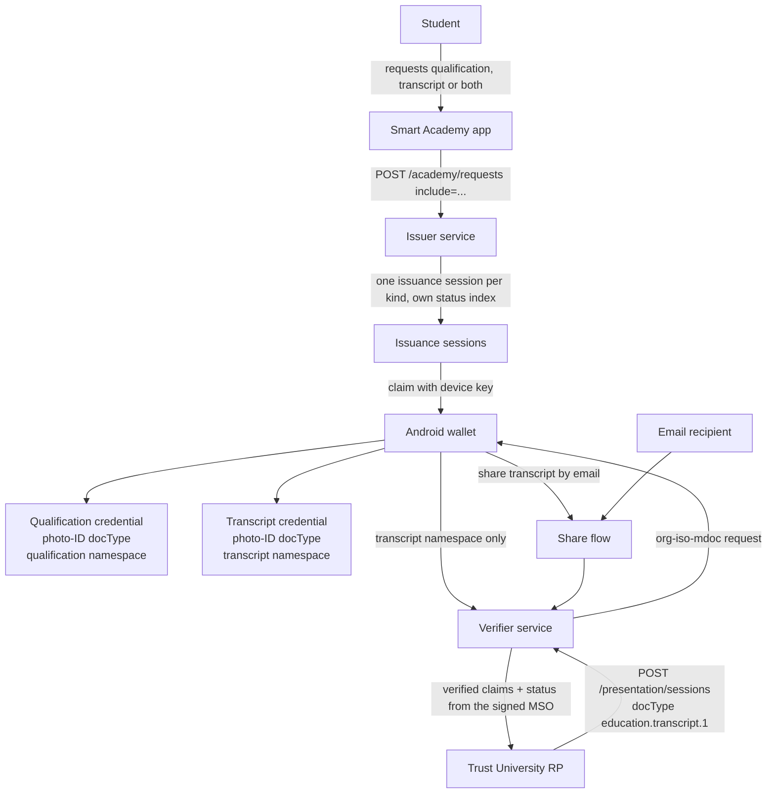

# Transcript Credential Architecture

## Requirements

A holder must be able to obtain a qualification credential, a transcript credential, or
both; a registrar must be able to request transcript information specifically; a Smart
Academy administrator must be able to see and manage what it issued; and a holder must
be able to share a transcript by email through the existing share and verification
path. Existing credentials in wallets and the My Jobs relying party must keep working
unchanged, and revocation must stay per credential.

## Options considered

| Option | Benefits | Risks | Decision |
|---|---|---|---|
| Keep one credential with all namespaces; choose only at presentation | No issuer change | Wallet cannot tell a qualification from a transcript; a registrar must request the identity credential and receive qualification claims with it; one status applies to everything | Rejected |
| One docType for both kinds - `org.iso.23220.photoid.1`, carrying the personal components - with the academic claims in their own namespace: `org.iso.23220.education.qualification.1` or `org.iso.23220.education.transcript.1` | The transcript keeps the personal components a registrar needs; the academic claims are separated per kind; existing credentials and the My Jobs request are untouched; a relying party selects by namespace, which is what the protocol is for | docType no longer identifies the kind, so the wallet, the portal and the credential offer must label by namespace | **Selected** |
| A distinct docType per kind (`org.iso.23220.education.transcript.1` for the transcript) | The kind is visible in the docType | Splits the document type away from the personal components it shares with a qualification; an unfamiliar docType to wallets and relying parties | Rejected |

## Selected design

### Credential kinds

Both kinds are issued as a photo-ID document (`org.iso.23220.photoid.1`) carrying the
holder's personal components; the academic namespace decides the kind.

| Kind | docType | Namespaces held | Used by |
|---|---|---|---|
| Qualification | `org.iso.23220.photoid.1` | `org.iso.23220.photoid.1` (personal), `org.iso.23220.education.qualification.1` | My Jobs, existing credentials |
| Transcript | `org.iso.23220.photoid.1` | `org.iso.23220.photoid.1` (personal), `org.iso.23220.education.transcript.1` (grades) | Trust University, sharing |

Selection is by namespace, not by docType: a registrar asking for the photo-ID docType with
the transcript namespace can only be satisfied by the transcript credential. Because the
docType is shared, the kind is reported explicitly (`kind`, `label`,
`academicNamespaces`) so the wallet, the portal and the academy app label a credential from
what it holds rather than guessing. A credential holding both academic namespaces - the
combined credential issued before the choice existed - is reported as `academic`.

Identity travels with both kinds so a registrar can bind a transcript to a person. The
holder still discloses namespace by namespace, so sharing a transcript can withhold
identity fields exactly as sharing a qualification does today.

### Service boundary

- **Issuer service** owns the kind definitions, per-kind namespace assembly, the
  issuance choice, the status index and the registry row. It never issues a namespace
  that does not belong to the requested kind.
- **Smart Academy app** presents the choice and claims each resulting credential.
- **Management portal** shows the kind per credential and scopes everything to the
  organisation, as it already does for one kind.
- **Verifier service** is unchanged in behaviour: it is told the docType and namespaces
  by the relying party, resolves status from the credential's signed MSO, and returns
  the disclosed claims.
- **Wallet** stores and labels each credential by kind and shares one kind at a time.

## API contract direction

- `POST /academy/requests` gains `include`: `qualification` (default), `transcript`, or
  `both`. One issuance session is created per requested kind; the response and the email
  list them.
- `GET /academy/credentials` entries gain `kind` and `docType`.
- `credentialData.docType` decides what `POST /credentials/issue`,
  `POST /issuance-sessions` and the claim path build; `docType` is no longer hard-coded.
- `POST /shares` uses the credential's own docType when it creates the verifier session,
  and refuses a category the credential does not hold.
- Relying parties pass `docType` and `nameSpaces` per session; Trust University asks for
  the photo-ID docType with the transcript namespace, plus the name elements a registrar
  needs. My Jobs keeps asking for the qualification namespace.
- One limitation to note: the OpenID4VCI credential offer names the docType, so both kinds
  look alike in an offer. The offer's pre-authorized code is the session, which is what
  carries the kind; the academy app is told it separately.

## Failure behavior and rollback

Unknown or missing `include` falls back to today's behaviour (qualification only).
A credential is never issued with namespaces from another kind. If a kind must be
withdrawn, stop offering it in the academy app and the portal; existing credentials keep
verifying and their status entries stay valid. Rolling back is reverting to one kind per
request, which leaves already-issued transcript credentials verifiable but unclaimable.

## Operational concerns

Each kind adds one registry row and one status index per issuance, so the status list
grows twice as fast when both are chosen; gaps are already harmless. The transcript
namespace carries a JSON `courses` string, so claim payloads are larger than a
qualification's — the portal and RP must not assume qualification-sized claims. No new
personal data is collected: the transcript is generated from the same academic record as
today.
