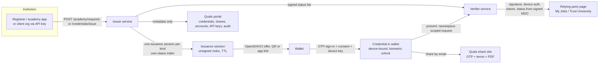

# Business case. Qualification credentials: issuance, wallet, verification

**Date:** 2026-09-20
**Status:** Draft for decision. Prices and volumes are hypotheses, marked as such; the product
description is grounded in the running system (see Appendix B for the evidence trail).
**Scope:** the academic credential system in this repository (issuer, wallet, verifier, the two
relying parties, the management portal) and the institution-side platform it plugs into
(Smart College: admissions, KYC, payments, CRM).
**Audience:** the board/decision maker, the institution partnership lead, and the Relying Party
integration lead. Written to be read by someone who has to decide whether to fund this.

---

## 1. Executive summary

**What exists.** A complete, standards-based loop: an institution issues a qualification or a
transcript as a signed ISO/IEC 18013-5 mDoc; the holder claims it into a wallet where it is bound to
their device and unlocked biometrically; a third party requests specific namespaces and receives only
the claims it asked for, cryptographically verified, with revocation resolved from a signed status
list **without contacting the issuing institution**. Seven services run it: the issuer and verifier
APIs, the Smart Academy student app, My Jobs (employer verification), Trust University (postgraduate
admissions), the Quals management portal, and the Quals share site.

**What is being sold.** Not software, and not cryptography — both are commodity. The product is
**the machine-checkable signature of an institution**. Today an institution's signature on a degree
is verified by a human process (email the registrar, pay a clearinghouse, courier a sealed envelope,
wait days). This system turns that signature into an API that any relying party can check in
milliseconds, at approximately zero marginal cost, without the institution being involved in the
check. That is a change in the *cost structure of trust*, and that is the business.

**Who values it, in one line each.**

| Actor | What they get | What they give up / must accept |
| --- | --- | --- |
| **Institute** (university, college, awarding body) | Their credential becomes instantly verifiable worldwide; new alumni-services revenue; lower document-handling cost; less fraud exposure; a digital-first reputation | Per-request involvement and visibility in verification; they must own key custody and publication of revocation, and take on operating discipline |
| **Quals** (the service provider) | Operates the whole trust layer: issuer-as-a-service, the wallet, the verifier, the status list, the trust registry, the portal | Carries availability obligation (a failed status list blocks every presentation) and the liability of being the middleman |
| **My Jobs** (employer / screening) | Instant, unforgeable qualification checks; lower cost per check; a "verified applicant" product | Depends on candidates holding a wallet; must keep a fallback path |
| **Trust University** (admissions) | Verified transcripts at application time instead of couriered documents; shorter cycle; less PII stored; less international transcript fraud | Depends on issuers it recognises being in the trust registry |
| **The customer** (learner, graduate, alumni) | Owns their record; discloses only what is asked; no fees, no couriers, no waiting; portable for life | Device loss is credential loss; they must trust a consent screen that does not yet tell them who is asking |

**The single most important business constraint.** This is a three-sided network — issuer, holder,
relying party — and value only appears when all three are present with real (not demo) credentials.
The technology is done enough. The risk is adoption, and the two-sided cold start is where most
projects of this shape die. Everything in Section 12 is organised around resolving that.

**Recommendation (see Section 8, Section 12).**

1. **Wedge on institution-side revenue that exists on day one** — alumni and registrar transcript
   ordering, where the institution already charges a fee and already carries the handling cost.
   Issuing credentials as the *delivery mechanism* for a document the institution already sells
   means the institution earns more, not less, on day one, and every transcript issued seeds a
   wallet.
2. **Anchor the value case on a real relying party with acute, quantified pain** — international
   admissions (Trust University's shape) is the strongest: transcript fraud is the pain, and the
   document that is forged most is the one this system handles natively.
3. **Do not lead with the wallet.** The holder gets real value but will not pay for it. Holders are
   the distribution, not the customer. Price the institutions and the relying parties.

**Five opportunities beyond what was built, ranked** (full list, 40 items, in Section 10):

| ID | Opportunity | Why it is the one to do |
| --- | --- | --- |
| **O-01** | Alumni/registrar transcript ordering replacing the courier process | Institution revenue on day one; solves the cold start; the document already exists |
| **O-02** | In-progress study / enrolment credential ("student status") | My Jobs already refuses a non-awarded credential — that refusal is unmet demand; needed for visas, loans, housing, discounts |
| **O-03** | Verifier policy engine returning a *decision*, not claims (rules: award level, GPA, date bounds, recognised issuer) | Relying parties buy decisions; the rules engine already exists in Smart College |
| **O-04** | Managed signing + status-list hosting as a service (HSM, rotation, HA, SLA) | Highest-margin, stickiest infrastructure play; also removes the biggest operational risk from institutions |
| **O-05** | Surface reader authentication in the wallet ("who is asking") | The server side is built and the wallet ignores it — the consent gap is the product's weakest trust point and a genuine differentiator once fixed |

---

## 2. The asset, described accurately

### 2.1 The loop as it works today

### 2.2 What is genuinely distinctive

These are the properties a competitor cannot copy by writing more code, and each has business weight:

1. **Revocation without calling the issuer.** The status reference lives in the signed MSO, which is
   not selectively disclosable, so the verifier always receives it. It resolves the published signed
   status list and checks it against the certificate that signed the presented credential. No issuer
   call, no per-check fee to the issuer, no issuer availability dependency at verification time.
2. **Fail-closed by design.** An unreachable or untrusted status list, or a credential with no status
   reference, *fails the presentation*. A revoked credential cannot verify. This is what makes the
   result usable as evidence rather than as a hint.
3. **Selective disclosure, scoped by namespace.** A registrar requesting the transcript namespace
   cannot receive a bare qualification, and vice versa. The holder discloses namespace by namespace.
   Fields deliberately not modelled at all include national insurance/SSN, ethnicity and residency.
4. **No central credential store.** The mdoc bytes are never persisted server-side; the issuer holds
   metadata, the wallet holds the document, and the issuance session expires. There is no honeypot to
   breach — and, less conveniently, no server copy to restore from.
5. **Multi-tenant issuance already works.** Client organisations each get an API key; a credential is
   stamped with the institution *from the key*, not from the request body, so one organisation cannot
   issue into another's name. Administrators are scoped to their own organisation.
6. **A verifier-side trust registry.** Issuers are registered, given a trust score, approved or
   blocked, with an audit log. This is the seed of a governance business, not just a feature.
7. **Reader authentication exists server-side.** The verifier signs `ReaderAuthentication` as a
   COSE_Sign1 and publishes its key as an RFC 7638 thumbprint (no CA needed). The wallet does not yet
   surface it.

### 2.3 Honest limits — what a buyer or an auditor will find

These are stated plainly because a business case that hides them is worthless:

| Limit | Business meaning |
| --- | --- |
| **Placeholder academic values.** Grades, credits, programme codes and calendars are US conventions (`us-gpa-4`, `us-credit-hour`, `CIP-2020`), stated rather than assumed, pending the institution's own model (P0-21) | No real institution can issue until it supplies its real scale, pass mark, credit scheme, programme titles, term calendar and institution identifier. This is a **pre-sale blocker**, not a backlog item |
| **Rotating the signing key invalidates every credential ever issued** | Key custody is a contractual matter. Institutions will not hold private keys competently; this is why a managed-signing service is both a risk mitigation and a product (O-04) |
| **Credentials issued before status lists existed are no longer presentable** | Any pilot cohort must be re-issued; migrations are not free. Announce the model early |
| **Once the wallet's app link host and the issuer's status-list base URL are set, they are effectively permanent** (the issuer address is stamped inside every credential; the academy address is baked into the wallet at build time) | Domains must be chosen before the first real credential. Attach a domain; never rename |
| **The wallet does not show who is asking** (`readerAuthAll` is ignored wallet-side) | The consent screen is the trust moment, and it currently cannot answer the holder's first question. Fix before selling to relying parties (O-05) |
| **Payment exists as a mechanic, not an integration.** A session with a fee returns `402 Payment required` until paid, but checkout is a placeholder URL and confirmation is a stub | A PSP integration is small work with immediate monetisation impact. Do it before any paid pilot |
| **The repository's own docs contradict each other about deployment capacity.** `README.md` says a hosted deployment is not built; `docs/deployment/railway.md` and `endpoints.md` describe seven live Railway services and their addresses; the container images cannot build (P1-01, P1-07) | Enterprise due diligence runs `npm ci` and reads your deployment guide. Fix the doc and the containers before the first institutional review, not after |
| **Demo scale.** One example issuer (Smart Academy), two relying parties, no paying customer | The market section below is a method, not a measured market. It must be replaced with primary data from real institutions |

---

## 3. The economic shift this represents

**The old cost structure.** A credential's trust is re-established *per use, per verifier, by human
process*. The registrar's office answers the request, applies a policy, produces a sealed document,
and charges for it. That is why official transcripts cost money and take days, and why background
screening pays per check to a clearinghouse. The cost of trust is recurring, linear in the number of
times trust is needed, and carried by the institution's labour.

**The new cost structure.** Trust is established *once*, at issuance, by a signature. Every
subsequent use is arithmetic: verify the signature, verify the device, read the status bit. Marginal
cost per verification approaches zero (the status list is cached; the crypto is microseconds), and
the institution is not in the loop.

Four consequences follow, and they are the whole business case:

1. **Per-verification pricing can reflect value, not cost.** With near-zero marginal cost, a free
   tier is affordable and is the fastest way to build the relying-party side of the network. Price
   the *decision* and the *assurance level*, not the CPU.
2. **An institution's signature becomes an API.** It can be embedded in an applicant tracking
   system, a clearinghouse workflow, an admissions form, or a bank's onboarding. Things that were
   impossible when verification meant a phone call.
3. **Verification is unbundled from the registrar's labour.** That is the value to the relying party
   and, simultaneously, the threat the institution will feel (Section 4.1). It must be priced and
   positioned so the institution is better off — which leads directly to the wedge in Section 8.
4. **The incumbent revenue line becomes contestable.** Any business that charges per verification
   (clearinghouses, screening aggregators, verification portals) is exposed to a substitute with
   near-zero marginal cost. Conversely, being the party that operates the trust layer means being
   able to tax both the issuance and the check.

---

## 4. What it means for each actor

### 4.1 Institutes (the issuing institutions)

**Value.**

- **Revenue.** Alumni/registrar transcript ordering (already sold, better delivered); micro-credentials
  and CPD where a certificate currently has no verification value; partnership and pathway programmes
  where a partner needs to check a cohort's completion; and a share of relying-party verification fees
  if the institution's brand is what the relying party trusts.
- **Cost.** Document handling, fulfilment and courier costs reduce; repetitive verification requests
  that reach the registrar's inbox reduce without a policy change.
- **Risk.** Fraud exposure — a forged transcript bearing the institution's name is a reputational and
  occasionally legal problem — reduces, because a forged document simply fails signature verification.
  Time-to-response stops being a competitive disadvantage in international recruitment.
- **Compliance posture.** No central credential store; only requested claims ever leave; sensitive
  identifiers are deliberately not modelled. FERPA- and GDPR-shaped arguments become easier, not
  harder. (This is a positioning asset, not just a compliance checkbox.)
- **Institutional capital.** A degree's value depends on its verifiability. Being an institution whose
  qualifications verify instantly, in standards-compliant form, is a small but real differentiator.

**What the institution must accept — and where resistance will come from.**

This is the crux of the sale, so it is worth being blunt:

| The institution loses | Why it stings | The counter-offer |
| --- | --- | --- |
| Involvement in each verification | The registrar's office stops being the gatekeeper and stops seeing who is asking what | They keep **revocation** authority (the status list) and **issuance** authority — they still decide what is true |
| Per-request transcript revenue if RPs stop requesting through them | This is real budget | They charge for **issuance** and for **accreditation/listing**, and they sell the alumni service better than they do today |
| A touchpoint with alumni | Alumni contact has fundraising value | The portal gives them an audit trail and a holder relationship they did not have |
| Operational simplicity | They now have key custody, rotation and publication duties | Managed signing and status-list hosting (O-04) removes almost all of it |

**Institution-side prerequisites before any real issuance:** their real grading scale and pass mark;
their credit scheme; their programme and award titles with classification codes; their institution
identifier; their term calendar; their student-id scheme. Every one of these is currently a
placeholder. This is the single largest piece of work between the demo and a signed institution, and
it should be sold as a professional-services engagement rather than absorbed.

### 4.2 Quals as service provider

**Position.** Quals operates the network: issuance on behalf of client organisations, the wallet that
holders carry, the verifier that relying parties call, the signed status list that makes revocation
work, the trust registry that decides who may issue, and the portal that administrators use. Owning
the holder relationship *and* the issuer relationship *and* the relying-party integration *and* the
governance layer is the strongest position in this value chain.

**Revenue lines.**

| Line | Payer | Meter | Note |
| --- | --- | --- | --- |
| Institution platform subscription | Institute | Annual, per institution | Predictable; the way to sell to procurement |
| Issuance usage | Institute | Per credential issued | Already metered by API key; the natural unit |
| Verification | Relying party | Per verification, or annual bundle | Free discovery tier is affordable because marginal cost ≈ 0 |
| Wallet/directory listing & accreditation | Institute | Annual per listing | The thing that makes a relying party trust an unknown issuer |
| Managed signing & status-list hosting | Institute | Annual + per key operation | High margin, high stickiness, removes the institution's hardest operational duty |
| Holder premium services | Holder | Per transaction | Expedite, legalisation, certified translation, lifelong vault |
| Aggregate insight (opt-in only) | Institute | Subscription | Verification demand and outcome reporting; no PII, no individual data, explicit consent |

**Why the position is strong.** The wallet is the only place where a holder's record lives, so the
holder relationship is held by Quals rather than by a portal the holder visits twice a year. The
status list is a hard dependency for everyone, which gives Quals a natural, defensible position as
the operator of public trust infrastructure — the same shape as a certificate authority.

**Where the position is fragile.**

1. **Availability is existential.** A verifier presentation *fails* if the status list cannot be
   fetched. Quals' uptime is not a hosting metric; it is every holder's ability to prove anything.
   This must be contracted as an SLA, engineered for HA (mirrors/CDN, cached lists, published
   signing keys), and monitored as a first-class product metric — not treated as infrastructure
   hygiene.
2. **The wallet may be commoditised.** If the W3C Digital Credentials API becomes the normal way a
   browser asks for a credential, the user-facing app stops being the distribution point. The answer
   is to move up-stack (trust, policy, governance, integration) and to issue into *other* wallets,
   not to defend the app.
3. **"Why do we need you?"** Institutions will eventually ask this. The honest answers are managed
   signing, governed accreditation, integration breadth, and availability — which is precisely why
   those should be products, not side effects.
4. **Becoming the issuer of record invites liability.** Quals issues *on behalf of* institutions and
   must be contractually the processor, never the source of truth. The code already reflects this
   (the institution is stamped from the API key); the contracts must match it.
5. **Standards drift.** ISO 18013-5/7, OpenID4VCI/VP, the EUDI ARF and the DC API are all moving.
   Participation is a cost of doing business, and it is also the marketing channel.

### 4.3 Relying parties — My Jobs (employment and screening)

**What changes.** The check becomes instant, needs no issuer contact, cannot be forged by editing a
document, and produces an auditable verification record. The page already refuses a credential that
is not a completed award rather than showing an empty table — a small design decision with real
business meaning: the system can be trusted not to silently accept the wrong thing.

**Value.** Cost per check against whatever the incumbent charges (clearinghouse checks and
paper-transcript verification are per-check line items); time-to-decision from days to seconds;
reduced hiring risk; evidence for the file; and a differentiated product ("your qualification is
verified before you interview").

**The dependency to handle.** My Jobs needs the *candidate* to hold a wallet. Until that is common,
the product must degrade gracefully: keep document upload as a fallback, and verify when a wallet is
available. The Smart College rules engine is the natural place to express "if a verified credential
is present, use it; otherwise require evidence".

**Opportunities specific to this shape:** ATS integration and webhooks; batch verification for a
cohort; re-verification when a credential's status changes; and identity reuse via an mDL credential
so onboarding captures identity once.

### 4.4 Relying parties — Trust University (admissions)

**What changes.** A registrar asks for the transcript namespace and receives only the disclosed
claims, cryptographically verified, with the verification time recorded, and nothing stored beyond
the session. When the applicant presents a qualification instead of a transcript, or a study still
in progress, the page says so in plain language instead of rendering a page of dashes.

**Value.** The admissions cycle shortens (offers can be made earlier, which affects yield);
international transcript fraud — the acute pain — is reduced to a signature check; courier and
document-storage costs fall; and the data-protection story improves because the institution never
receives, stores or leaks a scanned transcript. The `courses` table, the per-module marks with their
scale, and the recognition details mean an admissions officer sees a structured record rather than a
PDF.

**Dependencies to close.** A real presentation from a wallet on a device (P0-19's remaining item) and
a registry of issuers the university recognises. Recognition is the product: an admissions office
does not want "a verified credential", it wants "a verified credential from an institution I accept".

**Opportunities specific to this shape:** a recognition/evaluation workflow (the Lisbon Recognition
Convention and ENIC-NARIC style evaluation); conditional-offer automation; agent-channel verification
for international recruitment; credit transfer using the transcript namespace with scheme-qualified
credits; and — the internal one — making this the default evidence path in the Smart College
admissions funnel, replacing document upload (S-012 qualification evidence, S-013 admissions review,
S-017 transcript gate).

### 4.5 The customer (the holder: learner, graduate, alumni)

**Value.** They own the record rather than renting access to it from a registrar's office. They
disclose only what is asked (a landlord needing "student status" does not receive grades). They stop
paying for couriers and stop waiting days for a document the institution already holds. They keep a
portable record across institutions, borders and decades, which matters most for internationally
mobile students — the ones most poorly served today.

**Where they will pay, and where they will not.** They will not pay to hold a credential. They
plausibly will pay, per transaction, for: expedited official delivery (a premium on a fee they
already pay); legalisation/apostille and certified translation packs generated from verified claims;
a lifelong vault after graduation, when institutional access lapses; and painless replacement after
losing a phone. **Holder monetisation must be transactional and optional; a subscription for holding
one's own record generates resentment.**

**The sharp edges — these are the reasons a holder would churn or complain.**

| Edge | Business consequence |
| --- | --- |
| **Losing the phone loses the credential.** The mdoc bytes are never persisted server-side | Re-issue/recovery must be effortless and free, or the product's reputation fails on its first bad week. This is a support-cost and NPS issue, and it is also a feature to build (multi-device, backup, re-issue into an existing wallet) |
| **The consent screen cannot say who is asking** | The holder is asked to trust an unidentified requester. Fix before relying-party scale (O-05) |
| **Proving anything depends on Quals' availability** (fail-closed status list) | The holder experiences an infrastructure problem as "my degree is not valid any more" |
| **Smartphone, biometrics and accessibility requirements exclude some holders** | A paper fallback remains necessary for some cohorts; the institution cannot make the wallet the only path |
| **OTP + terms + consent friction per share** | Each additional step loses holders. Worth measuring completion per step before optimising anything else |

### 4.6 Secondary actors worth naming

Quality-assurance and accreditation bodies (programmatic accreditation evidence); recognition bodies
and credential evaluators; immigration and visa processes; professional licensing bodies;
background-screening companies; and SIS/LMS/CRM vendors, who are the most plausible distribution
channel rather than competitors.

---

## 5. Business model options

| # | Model | Payer | Meter | Strength | Weakness |
| --- | --- | --- | --- | --- | --- |
| 1 | Institution subscription | Institute | Annual | Predictable; sells to procurement; funds support | Slow to land; institutions buy annually, so early revenue is slow |
| 2 | Issuance fee | Institute | Per credential | Aligns with volume; already metered by API key | Tiny per-unit value; needs volume; invites "we'll do it in-house" |
| 3 | Verification fee | Relying party | Per verification / bundle | Captures value where it is felt | Relying parties resist per-check pricing unless it beats a real incumbent line item |
| 4 | Relying-party subscription/seats | Relying party | Annual + seats | Predictable; expansion revenue | Requires integrations to justify |
| 5 | Accreditation / listing fee | Institute | Annual | Funds governance; makes the registry a product | Perceived as a tax unless it demonstrably wins relying-party trust |
| 6 | Managed signing & status hosting | Institute | Annual + ops | High margin; removes institution's hardest duty; very sticky | Requires real operational maturity (HSM, SLA, on-call) before selling |
| 7 | Holder premium transactions | Holder | Per transaction | No dependency on institution budget | Needs a payment integration and genuine convenience |
| 8 | Aggregate, opt-in insight | Institute | Subscription | Institutions genuinely want outcome data | Privacy-fragile; one bad story costs the whole business; strictly opt-in and aggregate or do not do it |

**Recommended shape.** A hybrid, in this order of proof:

1. **Institution:** annual platform subscription + per-credential issuance, sold against a quantified
   transcript-handling cost reduction and new alumni revenue (models 1 + 2).
2. **Relying party:** a free discovery tier plus annual bundles, priced against the incumbent's
   per-check line (models 3 + 4). Free is affordable precisely because marginal cost is ~0.
3. **Holder:** free to hold and share; transactional premium only (model 7).
4. **Infrastructure:** managed signing and status-list hosting as a paid add-on, priced as
   insurance against the institution's own operational failure (model 6).
5. **Governance:** accreditation/listing fees once more than a handful of issuers exist (model 5).

**Rationale for who pays.** The institution is the party whose credential is being made more
valuable and whose handling cost falls, and it has a budget line for student systems. The relying
party is the party whose verification cost falls and who currently pays a third party for the same
outcome. The holder receives value but has no budget line, and charging them restricts the
distribution the whole network depends on.

---

## 6. Illustrative economics (assumptions, not forecasts)

No measured market data exists for this system yet — there are zero paying customers. What follows is
a model *structure* with placeholder values, so that the sensitivity can be argued about now and the
values replaced by primary research before any commitment.

**Drivers.**

| Driver | Symbol | Illustrative value | How to validate |
| --- | --- | --- | --- |
| Institutions in the programme | $N_I$ | 5 | Sales pipeline; letters of intent |
| Graduates/cohort completions per institution per year | $G$ | 4,000 | Institution's own registry figures |
| Credentials per completion (qualification, or qualification + transcript) | $k$ | 1.3 | Product decision; the academy flow already offers a choice |
| Issuance price | $p_i$ | £1.50 | Institution willingness-to-pay against handling cost |
| Share of issued credentials presented within a year | $u$ | 15% | Pilot measurement |
| Verifications per presented credential | $v$ | 2.5 | Pilot measurement |
| Verification price | $p_v$ | £2.50 | Relying-party comparison to incumbent per-check cost |
| Institution subscription | $S$ | £15,000/yr | Procurement interviews |

**Illustrative year-one revenue.**

$$R = N_I \cdot S + N_I \cdot G \cdot k \cdot p_i + N_I \cdot G \cdot k \cdot u \cdot v \cdot p_v$$

$$R = 5(15{,}000) + 5(4{,}000)(1.3)(1.50) + 5(4{,}000)(1.3)(0.15)(2.5)(2.50) \approx £75{,}000 + £39{,}000 + £24{,}375 \approx £138{,}000$$

**Scenarios.** (Same price assumptions; only the adoption drivers move. Graduates are per
institution.)

| Scenario | $N_I$ | Graduates/institution | $u$ | Verifications | Revenue |
| --- | --- | --- | --- | --- | --- |
| Bear | 2 | 1,500 | 5% | ~488 | ~£37,100 |
| Base | 5 | 4,000 | 15% | ~9,750 | ~£138,400 |
| Bull | 20 | 5,000 | 30% | ~97,500 | ~£738,800 |

**What the model says — and this is the useful conclusion.**

1. **Revenue is dominated by how many institutions sign and how much relying-party volume exists,
   not by price.** Doubling every price moves the base case by roughly £63k; going from 5 to 20
   institutions moves it by ~£600k. **Distribution beats pricing. Spend on partnerships and
   integration, not on price optimisation.**
2. **Subscription revenue is 54% of the base case with only 5 institutions**, which is why the
   institution sale must be led by the platform value (handling cost, alumni revenue, fraud) rather
   than by the credential novelty.
3. **Cost structure is software-like.** Hosting for seven services, a SQLite volume, and per-message
   email are the direct costs; the mdoc is never stored, so storage does not grow with credentials.
   The real cost of goods sold is **integration and support** — the O-04 managed-signing service is
   attractive partly because it converts unbounded support cost into a defined service. Model support
   as the dominant cost per institution until proven otherwise.
4. **Free relying-party tiers are rational.** At ~0 marginal cost, a free tier that produces the
   verification volume in the numerator of the network effect is cheaper than paid acquisition.

*These figures are illustrative and must not be quoted externally. They exist to expose the
sensitivity, and to make the point that the binding constraint is distribution.*

---

## 7. Sizing the market credibly

There is no honest market-size number available yet, and quoting one would be a mistake. The correct
approach, and the one to fund, is a bottom-up build from institution-level facts:

1. **Count the institutions that could issue** in the target segment and geography, and the number of
   completions each produces per year. That gives credentials issuable per year.
2. **Count the verification events** those credentials would attract within one year (admissions
   applications, employment checks, licence applications, credit transfer) — the numerator of the
   verification business.
3. **Establish the incumbent cost per event** (what the registrar, clearinghouse or courier charges
   today). That is the ceiling on willingness to pay, and it is a real, findable number per
   institution and per relying party.
4. **Multiply by the share of events that can realistically be digital in the first cohort** — which
   depends on holder adoption, so it must be measured, not assumed.

**Segment attractiveness, using the criteria that actually decide it** (fraud pain × document volume
× relying-party willingness to pay × institutional digital maturity):

| Segment | Fraud pain | Volume | RP willingness to pay | Readiness | Verdict |
| --- | --- | --- | --- | --- | --- |
| Higher-ed degree + transcript, international admissions | High | High | High | Mixed | **Beachhead** |
| Alumni/registrar transcript ordering | Low | High | n/a (institution pays/pays itself) | High | **Wedge** — because it funds the wedge with existing revenue |
| Background screening / employment | High | Very high | High | Mixed | **Scale play**, once integrations exist |
| Professional licensing and CPD/micro-credentials | Medium | Medium | Medium-High | Low | Strong later; less crowded |
| Secondary/K-12 leaving certificates | Medium | High | Medium | Low | Later; different sales motion |
| Government skills and workforce programmes | Medium | High | Medium | Low | Later; procurement-heavy |
| Credit transfer and recognition across borders | High | Medium | Medium | Low | Strategically important if EU/EUDI-aligned |

---

## 8. Competitive position

**The alternatives a buyer is already using.**

| Alternative | Why it is used today | Where this system wins | Where it is still weaker |
| --- | --- | --- | --- |
| PDF/email transcript + manual verification | Free, familiar | Forgery resistance; no manual labour; audit trail | Institution relationships take time to build |
| Clearinghouses and transcript networks | Installed base of registrars and RPs; FERPA-comfortable | Holder-controlled; real-time; international; no per-check issuer dependency | No registrar network, no enrolment data, no decades of trust |
| Document-verification and screening vendors (incl. regional transcript-verification players) | Fast to buy; API-first | Standards-native (ISO mDoc + DC API) rather than a proprietary portal; holder-held rather than centrally stored | No installed RP base; no brand |
| Credential evaluators / recognition agencies | They provide judgement, not just verification | Can supply verified claims as an input to their process | Evaluation is a service business; do not compete, integrate |
| Europass/EDCI-style public infrastructure and EUDI wallets | Public mandate; free at point of use | Works today, private-sector speed, non-EU geographies | Public infrastructure will take the low end and set standards; it also expands the market |
| In-house portals and blockchain diploma pilots | Institutional control; novelty funding | Privacy (no central ledger), selective disclosure, revocation that works, standards compliance | Blockchain pilots have political momentum inside some institutions |
| "Do nothing" | Nobody is fired for the status quo | Fraud and time-to-decision are measurable costs | Requires a champion inside the institution |

**What is defensible here, honestly.** Not the cryptography — it is all open standards, and that is a
feature, not a weakness. What is defensible is:

1. **Governance and accreditation** — who is allowed to issue, who is recognised, who is blocked, with
   an audit trail and a published trust list.
2. **The holder relationship** — the wallet is where the record lives.
3. **Integration breadth** — the number of relying-party and SIS/ATS integrations, which is grunt
   work that compounds.
4. **Availability and operational trust** — running revocation and signing infrastructure that
   institutions can rely on, with an SLA.
5. **Standards position** — being the reference implementation in the ecosystems that will define how
   credentials move (ISO 18013-5/7, OpenID4VCI/VP, EUDI, W3C DC API, and the multipaz community this
   repository builds on).

---

## 9. Risks and mitigations

| # | Risk | Severity | Mitigation |
| --- | --- | --- | --- |
| R-1 | **Three-sided cold start.** No wallet holders without issuers; no reliance without holders | Blocker | Wedge on a document the institution already sells (O-01); free RP tier; **always** keep a non-wallet fallback so no relying party is ever blocked |
| R-2 | **Institution perceives disintermediation** and defends per-request transcript revenue | High | Price issuance + accreditation; give them the alumni/registrar revenue; keep revocation and issuance authority visibly theirs; white-label where needed |
| R-3 | **Key custody failure or key rotation** invalidates every issued credential | High | Managed signing with HSM, published key history and overlap windows; contract key custody explicitly; rehearse rotation |
| R-4 | **Status-list unavailability fails every presentation** (fail-closed by design) | High | HA + mirrored/CDN lists, caching, published keys, monitoring, contractual SLA; treat uptime as a product metric |
| R-5 | **Holder loses the device** and the credential cannot be restored (no server copy) | High | Effortless, free re-issue into an existing or new wallet; multi-device; backup story before launch at any scale |
| R-6 | **Consent gap** — the wallet cannot say who is asking | High (trust) | Surface reader authentication and build a verified-requester directory (O-05) |
| R-7 | **Placeholder credential model values** ship to a real institution | High | Sell the institution's own model (scale, codes, calendar, identifiers) as a paid discovery engagement; block real issuance until signed off (P0-21) |
| R-8 | **Standards/ecosystem shift** (DC API in the browser; EUDI wallets) commoditises the app | Medium-High | Issue into and accept from other wallets; move up-stack into trust, policy and governance; contribute upstream |
| R-9 | **Data protection / consent framing** (FERPA, GDPR, and the fact that verification receipts are personal data) | Medium-High | Keep the minimal-data design; formalise DPIAs, terms and retention; the share flow already records terms acceptance — extend that discipline to verification receipts |
| R-10 | **Relying parties cannot tell a recognised issuer from an unknown one** | Medium | Sell the accreditation/listing product; make recognition explicit on the relying-party page |
| R-11 | **Payments never wired** — monetisation is not actually exercisable | Medium | PSP integration behind the existing `402 Payment required` gate; small work, immediate effect |
| R-12 | **Enterprise diligence exposes doc/deployment gaps** (containers that cannot build, contradictory docs, CI install failure) | Medium | Close P1-01, P1-02, P1-07 before the first institutional security review |
| R-13 | **Support cost scales with holders, not with contracts** (device loss, OTP friction, accessibility) | Medium | Invest in self-service recovery; measure completion per step; keep an assisted path for excluded cohorts |
| R-14 | **Regulatory change around credential presentation and age/identity checks** | Low-Medium | Track EUDI/ARF and national guidance; design for delegation to a government identity credential rather than duplicating it |

---

## 10. Business opportunities beyond what has been built

Forty opportunities, grouped, each with the payer and why it matters. "Effort" is engineering/partner
effort, not calendar time. Anything selected here becomes a story before it is built.

### A. Credential and document expansion

| ID | Opportunity | Payer | Why it matters | Effort |
| --- | --- | --- | --- | --- |
| O-01 | **Alumni/registrar transcript ordering** — replace the courier process with an issued credential, priced like today's transcript fee | Institution (and holder for expedite) | Funds the wedge from existing revenue; seeds wallets with every order | M |
| O-02 | **In-progress study / enrolment credential** (student status) | Institution; RP per check | My Jobs already refuses non-awarded credentials — that refusal *is* unmet demand; needed for visas, loans, housing, discounts | S–M |
| O-06 | **Micro-credentials and CPD certificates** | Awarding body / employer | High-growth, currently unverifiable; short courses have no trust infrastructure | M |
| O-07 | **Professional licensing and registration credentials** | Regulator / professional body | Legally significant, high value per check; regulators already maintain registers | M–L |
| O-08 | **Apprenticeship and vocational records** | Government / provider | Policy-backed funding and compliance reporting | M |
| O-09 | **Secondary/K-12 leaving certificates and exam boards** | School system / exam board | Large volumes; different sales motion and safeguarding constraints | L |
| O-10 | **Employer-issued training and employment records** | Employer | Turns the wallet into a career record, not just an academic one; drives daily usefulness | M |
| O-11 | **Stackable, module-level credentials that compose into a degree** | Institution | Directly addresses the modular-learning market; needs a composition model | L |
| O-12 | **Joint, co-badged and mobility credentials** (multiple issuers on one credential) | Consortium / institution | Enables Erasmus-style mobility and joint degrees; requires multi-issuer signing policy | L |
| O-13 | **Credit-transfer and recognition packs** (scheme-qualified credits, ELMO/EuroLMAI-shaped) | Institution / recognition body | The transcript namespace was designed for exactly this; unlocks recognition workflows | M–L |
| O-14 | **Apostille, legalisation and certified translation packs** generated from verified claims | Holder / institution | A real, boring, high-value transactional business sitting on top of the credential | M |
| O-15 | **Assessment and language-proficiency credentials** (test providers) | Test provider | A natural partner category; they sell verification as a product already | S–M |

### B. Verification and trust expansion

| ID | Opportunity | Payer | Why it matters | Effort |
| --- | --- | --- | --- | --- |
| O-03 | **Verifier policy engine returning a decision, not claims** — award level, GPA, date bounds, recognised issuer, "completed only" | Relying party | Relying parties buy decisions; the rules engine pattern already exists in Smart College; My Jobs already hand-codes one rule | M |
| O-16 | **Assurance tiers** — signature only, + status, + issuer accreditation, + identity binding | Relying party | Lets a low-risk check be cheap and a high-risk check be expensive; the trust-score registry is the seed | M |
| O-17 | **Verification-as-a-service for the institution's own processes** (internal verification, credit transfer, alumni checks) | Institution | Sells the same infrastructure back to the registrar, turning a perceived threat into a tool | S–M |
| O-04 | **Managed signing and status-list hosting** (HSM, rotation, published key history, HA, SLA) | Institution | Highest-margin, stickiest play; neutralises R-3 and R-4 for the customer | L |
| O-18 | **Public trust list / issuer transparency log** — who may issue what, with revocations of issuer rights | Ecosystem | The certificate-authority shape; makes the registry a public good and a moat | M |
| O-19 | **Issuer accreditation and de-listing service** | Institution / ecosystem | Governance is the defensible part; it is also what makes a relying party trust a stranger's signature | M |
| O-20 | **Fraud and anomaly signals** — degree-mill patterns, impossible institution/programme combinations, duplicate identities, device anomalies | Relying party | Verification is binary; fraud detection is what risk teams actually buy | M–L |
| O-21 | **Human review for suspicious presentations** (a service, not a feature) | Relying party | Some relying parties will pay for a person to look at the 0.5% that looks wrong | S–M |
| O-22 | **Batch and API verification, ATS/HRIS/SIS integrations, webhooks** | Relying party / institution | Volume only happens through integrations nobody enjoys building; this is where the compounding moat is | L |
| O-23 | **Reader authentication** surfaced to the holder, plus a verified-requester directory | Relying party (listing) / trust | Closes the product's weakest trust point; the directory is monetisable | S–M |
| O-24 | **Holder-visible disclosure receipts** — what was shared, with whom, when | Holder trust | Consumer-grade accountability; a differentiator against central databases | S |
| O-25 | **Offline / proximate verification** with deferred status check (mDL-style) | Relying party | Matters for field and in-person checks; engineering-heavy | L |

### C. Wallet, identity and reach

| ID | Opportunity | Payer | Why it matters | Effort |
| --- | --- | --- | --- | --- |
| O-26 | **mDL / identity credential support and identity reuse across relying parties** | RP (KYC reuse) | Onboard a user once; the multipaz base already supports mDL; the Smart College KYC investment compounds | L |
| O-27 | **Issue into and accept from other wallets** (OpenID4VCI/VP, EUDI-style) | Ecosystem / institution | Removes wallet lock-in as an objection and expands distribution beyond your own app | L |
| O-28 | **Effortless recovery and multi-device** (re-issue into an existing wallet, device migration) | Holder (free) / institution | Mitigates R-5; the single biggest NPS risk in a holder-held model | M |
| O-29 | **Browser-only holder** (no app install, DC API path) | Institution / holder | A native app is a large ask; browser reach is what makes adoption plausible at scale | M–L |
| O-30 | **White-label wallet and branded credential design** | Institution | Lets an institution put its own name on the holder experience; design groundwork exists (P0-26, P0-32) | M |
| O-31 | **Holder vault for other life documents** (licences, certificates, permits) | Holder / partners | Expands from academia to a general verified-document wallet | L |
| O-32 | **Accessible and assistive-first flows, plus a paper/assisted fallback** | Institution (equity obligation) | Digital-only exclusion is a real institutional risk (R-13) and a differentiator in public-sector tenders | M |

### D. Business model, go-to-market and partnerships

| ID | Opportunity | Payer | Why it matters | Effort |
| --- | --- | --- | --- | --- |
| O-33 | **Payment integration behind the existing `402` issuance gate** | Holder / institution | The paywall mechanic exists and is unconnected; smallest work with the most immediate monetisation effect | S |
| O-34 | **Verification marketplace / issuer directory** where relying parties discover accredited issuers | Both sides | Turns the registry into a demand-generating product rather than a control | M |
| O-35 | **Institution-facing analytics on verification demand** (opt-in, aggregate only) | Institution | Institutions want to know where their graduates' credentials are being checked; strictly aggregated and consented, or not at all | M |
| O-36 | **SIS/LMS/CRM channel partnerships** (including the Salesforce Education Cloud surface already in play in Smart College) | Partner-sourced | The fastest plausible route to institution volume; app-marketplace distribution | L |
| O-37 | **Screening and clearinghouse partnerships** rather than head-on competition | Partner-sourced | They hold the RP network; a standards-native supply of verified claims is complementary to them | M |
| O-38 | **Government, workforce and skills-agency programmes** | Public funding | Long cycles, large volumes, strong mandate for verifiable skills | L |
| O-39 | **Insurance/warranty on verified credentials** for relying parties who bear the fraud loss | Relying party | Monetises the residual risk the technology cannot eliminate; needs actuarial data first | L |
| O-40 | **Recognition evaluation workflow for admissions** (assisted judgement on top of verified claims) | Institution | Integrates rather than competes with evaluators; high willingness to pay in international admissions | M–L |

### E. Internal leverage — the same group's other platform

| ID | Opportunity | Payer | Why it matters | Effort |
| --- | --- | --- | --- | --- |
| O-41 | **Make verified credentials the default evidence path in the Smart College admissions funnel**, replacing document upload (S-012 qualification evidence, S-013 admissions review, S-017 transcript gate) | Internal | The cheapest possible proof of the value case: a real, own-controlled relying party with actual applicant volume | M |
| O-42 | **Reuse the KYC/identity investment** so that an applicant who is already identity-verified presents a verified identity credential rather than repeating KYC at each institution | Internal / institutions | Turns two separate product investments into one onboarding story | L |
| O-43 | **Reuse the payment service for issuance and transcript fees** rather than building a second billing path | Internal | Faster to monetise; keeps billing in one place | S–M |

### Prioritised shortlist

| Rank | ID | Opportunity | Impact | Effort | Why now |
| --- | --- | --- | --- | --- | --- |
| 1 | O-01 | Alumni/registrar transcript ordering | High | M | Only item that produces institution *revenue* on day one and solves the cold start |
| 2 | O-02 | In-progress study credential | High | S–M | Existing refusal in My Jobs is documented unmet demand |
| 3 | O-03 | Verifier policy engine (decision, not claims) | High | M | Turns a verification utility into something relying parties buy |
| 4 | O-05 / O-23 | Wallet shows who is asking + requester directory | High | S–M | Server side already built; the trust gap is the product's weakest point |
| 5 | O-04 | Managed signing + status hosting | High | L | High margin, very sticky, and it removes the two risks (R-3, R-4) that would otherwise sink a pilot |
| 6 | O-33 | Payment integration | Medium | S | Trivial work, unlocks all pricing experiments |
| 7 | O-22 | ATS/batch/webhook integrations | High | L | The compounding moat; start with one ATS in the beachhead |
| 8 | O-18 / O-19 | Transparency log + accreditation service | Medium-High | M | Prerequisite for relying parties trusting unknown issuers at scale |
| 9 | O-41 | Verified credentials as the default evidence path in Smart College admissions | High | M | Cheapest, most controllable proof of value |
| 10 | O-28 | Recovery and multi-device | High | M | Without it, every lost phone is a support incident and a detractor |

---

## 11. KPI framework

Measured from the day a real issuer joins, with a baseline established before any change.

| Actor | Leading indicator (weeks) | Lagging indicator (quarters) |
| --- | --- | --- |
| Institute | Institutions in onboarding; credentials issued per completion; registrar hours per transcript request | Transcript revenue per 1,000 completions; cost per official document issued; fraud incidents involving institution name; % of verification requests that no longer reach the registrar |
| Quals | Issuing organisations; credentials issued; wallets with ≥1 credential; verification endpoints integrated | Verification volume per month; net revenue retention; gross margin; status-list uptime and p95 latency; support cost per 1,000 holders |
| Relying party | Sessions created; presentations attempted | Verification success rate; time-to-decision versus baseline; cost per check versus incumbent; applicant drop-off at verification; fraud caught |
| Holder | Claim completion rate per step; time from offer to claim | Shares per holder per year; **disclosure minimisation** (claims disclosed ÷ claims requested); support tickets for lost device/recovery; would-recommend |
| System health | Status-list availability; session failure reasons | Presentations that fail closed for the right reason vs the wrong reason; key rotation rehearsals completed |

**The two numbers that decide whether this is working:** *issuing organisations* (supply) and
*verifications per thousand holders* (demand). Everything else is a diagnostic.

---

## 12. Milestones and decision points

Each milestone ends in an explicit go/no-go with named evidence, not a date alone.

### Wave 0 — Prove the loop with one real issuer and one real relying party
Build: institution's own credential model (scale, codes, calendar, identifiers); wallet consent
surface showing who is asking; payment integration; recovery path.
Evidence required: a real graduate's real qualification claimed on a device and verified by a real
relying party, with revocation demonstrated live and a key-rotation rehearsal completed.
**Decision point:** is the loop operational and supportable? If holder claim completion is below an
acceptable threshold, stop and fix the funnel before selling anything.

### Wave 1 — Institution revenue wedge
Build: O-01 alumni/registrar ordering, O-02 in-progress credential, the transparency log (O-18) and
accreditation basics (O-19).
Evidence required: two institutions issuing for real and charging a fee; institution-verified
handling-cost reduction; first paying contract.
**Decision point:** does an institution pay? If not, the model is wrong, not the product — revisit
Section 5 before building more.

### Wave 2 — Relying-party network and decisions
Build: O-03 policy engine, O-22 one ATS/screening integration, O-16 assurance tiers, O-20 fraud
signals (initial).
Evidence required: one relying party live in a production workflow with a measured cost-per-check
improvement against its incumbent; verification volume growing without manual chasing.
**Decision point:** is the relying party paying, and is the volume compounding?

### Wave 3 — Platform and infrastructure
Build: O-04 managed signing and status hosting with a contractual SLA, O-33-class billing,
O-27 other-wallet interoperability, O-41 Smart College integration.
Evidence required: SLA met over a quarter with an external audit trail; multi-tenant isolation proven;
first infrastructure-only customer.
**Decision point:** can this run as infrastructure with a defensible margin, or does it remain a
services business?

### Explicitly deferred
Region-specific recognition frameworks; blockchain-style anchoring (no business need identified);
holder subscriptions (resented); and any reliance on data monetisation (privacy-fragile, and the
downside dwarfs the upside).

---

## 13. Open questions and assumptions to validate

1. **Will an institution pay for issuance, or only for handling-cost reduction?** Test: two paid
   pilots, priced both ways.
2. **What is the incumbent cost per verification** at the first relying party (clearinghouse, courier,
   manual)? Test: their invoices. This sets the price ceiling and is knowable.
3. **What share of completions convert to wallet claims** without incentives? Test: measure Wave 0;
   this single number drives every scenario in Section 6.
4. **Do holders accept a wallet as the only path**, or is a paper fallback required indefinitely?
   Test: cohort research, including accessibility and low-connectivity cohorts.
5. **Will institutions accept managed signing** (private keys not on their premises)? Test: security
   review with two institutions.
6. **What is the relying party's tolerance for fail-closed behaviour** — is a revocation-check outage
   an incident, or an acceptable reason to refuse a check? Test: contract terms with the first
   relying party.
7. **Does a standards-native holder-held model beat the incumbents commercially**, or only
   technically? Test: win/loss against a clearinghouse in one real procurement.
8. **Is the trust registry a product or a cost centre?** Test: would a relying party pay to subscribe
   to accreditation status, and would an issuer pay to be listed?
9. **What does the institution-side integration actually cost** (SIS extract, identity mapping,
   student-id scheme)? Test: one time-and-materials engagement, then productise it.
10. **Which single geography first?** The answer depends on fraud pain, data-protection regime, and
    whether public wallet infrastructure (EUDI-style) helps or competes. Test: 8–12 interviews across
    two candidate markets before Wave 1.

---

## Appendix A. Capability to business mapping

| Business capability needed | State today |
| --- | --- |
| Issue a signed credential on behalf of an organisation | Built — API key per client org; institution stamped from the key |
| Holder claims it, device-bound, with consent | Built — OTP, consent, terms, device key |
| Selective disclosure by namespace | Built |
| Verification with claims, device auth, reader auth | Built |
| Revocation that works without contacting the issuer | Built — MSO status index + signed status list, fail-closed |
| Administrator lifecycle and audit | Built — org-scoped admins, audit log, API keys |
| Email-based sharing with terms and PDF | Built — one-time session, OTP, TTL, PDF |
| Institution-owned credential model | **Missing** — US placeholder conventions pending |
| Billing and payments | **Missing** — fee gate exists, no PSP |
| Holder recovery / multi-device | **Missing** |
| Wallet-side "who is asking" | **Missing** — server-side reader auth built |
| Relying-party policy/decisioning | **Missing** |
| Integrations (ATS/SIS/HRIS), batch, webhooks | **Missing** |
| Managed signing / status-list SLA | **Missing** |
| Issuer accreditation / transparency log | **Missing** — registry exists per relying party, not as public infrastructure |
| Enterprise packaging (containers that build, consistent docs, CI green) | **Incomplete** — P1-01, P1-02, P1-07 |

## Appendix B. Evidence trail

| Claim in this document | Source |
| --- | --- |
| Services, ports, addresses, deployment shape | `README.md`, `docs/deployment/railway.md`, `docs/deployment/endpoints.md` |
| Credential kinds, namespaces, docType | `docs/architecture/transcript-credential-architecture.md` |
| Claim sets, scheme qualification, US conventions, open institution values | `docs/architecture/transcript-credential-architecture.md`, `docs/analysis-discovery/transcript-model-facts.md` |
| Revocation via signed MSO + status list, fail-closed | `README.md`, `status-list-core.js`, `verifier-service/src/status-list.js` (verified by the repository's own test suites) |
| Metadata-only persistence; mdoc bytes never stored | `README.md`, `db.js` |
| Client organisations and API-key-scoped issuance | `issuer-service/src/client-orgs.js`, `POST /credentials/issue` |
| Issuer API surface, including the fee gate | `issuer-service/src/index.js` (`createCheckout`, `confirmPayment`, `402 Payment required`) |
| Trusted-issuer registry and trust scores on the verifier | `verifier-service/src/index.js`, `docs/deployment/endpoints.md` |
| Relying-party behaviour (My Jobs refuses non-awarded; Trust University refuses non-transcript) | `docs/stories/P1-10-what-holders-and-verifiers-see.md`, `docs/stories/P0-19-trust-university-registration.md` |
| Wallet not surfacing reader authentication | Session/repository notes on `verifier-service/src/reader-auth.js` and the wallet presentment path |
| Test counts at the last recorded UAT pass (76 issuer, 61 verifier, 27 wallet) | `docs/analysis-discovery/uat-transcript-flow.md` |
| Known repository gaps (containers, docs, CI) | `README.md` ("Not built yet"), `docs/stories/P1-01`, `P1-02`, `P1-07` |
| Smart College capabilities (KYC, payments, rules engine, Salesforce Education Cloud) | `c:\Users\Smelm\Smart College` — `docs/stories/S-012`, `S-013`, `S-017`, `S-045`, `S-046` |
